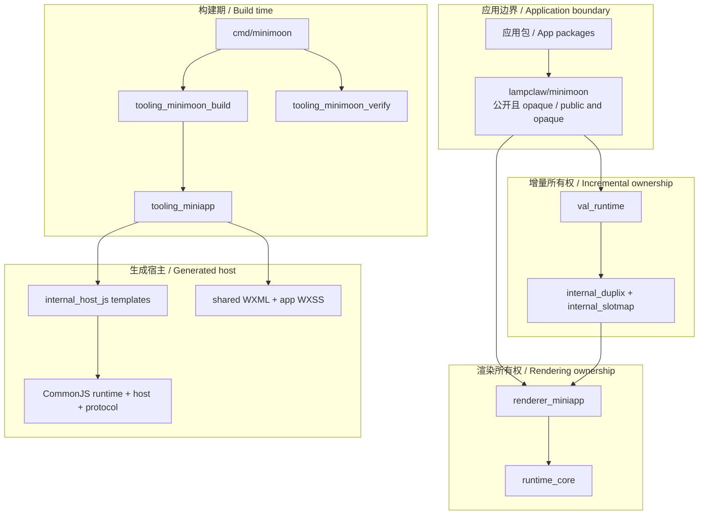
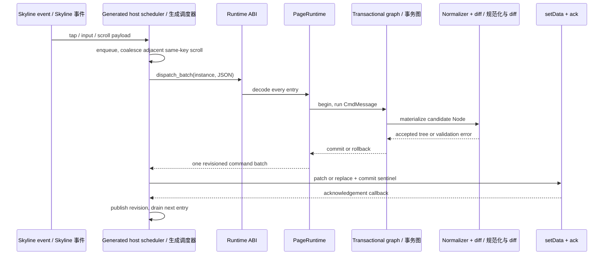
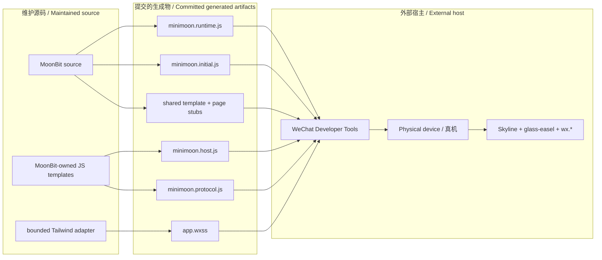

# 01. 系统架构 / System Architecture

[返回索引 / Back](README.md) · [下一篇 / Next](02-AUTHORING-MODEL.md) · [高清图表 / Diagrams](assets/diagrams/README.md)

## 1. 架构结论 / Architectural Conclusion

Minimoon 是一个“应用内 MoonBit runtime + 构建期 native 工具 + 生成的 MiniApp host”架构，而不是浏览器 DOM 框架，也不是把 MoonBit 业务逻辑翻译成手写 JavaScript。应用只依赖根包 `lampclaw/minimoon`；图、renderer、runtime、host 模板和生成器都被隐藏在其后。

> **English:**
>
> Minimoon uses an in-application MoonBit runtime, native build-time tooling, and a generated MiniApp host. It is neither a browser DOM framework nor a translator from MoonBit business logic into handwritten JavaScript. Applications depend only on the root `lampclaw/minimoon` package; the graph, renderer, runtime, host templates, and generator remain behind it.

系统的主要一致性边界是页面实例。`Page::create_runtime(input?)` 在真实输入解码成功后才创建独立 graph、state slot、事件表、订阅集合、规范化缓存和 host revision，并返回 Result；生成宿主为成功创建的页面配置 scheduler。同一路由的两个实例不会共享这些可变状态，输入错误则不创建页面图。

> **English:**
>
> The primary consistency boundary is a page instance. `Page::create_runtime(input?)` returns a Result and creates an independent graph, state slots, event table, subscriptions, normalization cache and host revision only after actual input decodes successfully. The generated host supplies its scheduler. Two instances of the same route do not share this mutable state; invalid input creates no page graph.

## 2. 分层与所有权 / Layers and Ownership



[SVG](assets/diagrams/svg/01-SYSTEM-ARCHITECTURE-1.svg) · [PNG 3×](assets/diagrams/png/01-SYSTEM-ARCHITECTURE-1.png) · [Mermaid](assets/diagrams/source/01-SYSTEM-ARCHITECTURE-1.mmd)

根包拥有所有应用可见类型，并通过不可见 wrapper 把调用转给内部包。这样，内部实现可以拆分文件或替换算法，而 `.mbti` 仍能证明应用表面没有泄漏 `renderer_miniapp`、`runtime_core` 或 `val_runtime` 类型。

> **English:**
>
> The root package owns every application-visible type and delegates through opaque wrappers. This lets internal implementations split files or replace algorithms while `.mbti` proves that `renderer_miniapp`, `runtime_core`, and `val_runtime` types have not leaked into the application surface.

> **源码 / Source:** [`src/authoring_core.mbt`](../../src/authoring_core.mbt) · symbols: `Emit`, `create_state`, `Val`

```moonbit
pub(all) struct Emit[Msg]((Msg) -> Cmd)

pub fn[Model : Eq, Msg] create_state(
  initial : Model,
  update~ : (Model, Msg, Emit[Msg]) -> (Model, Cmd),
  subscriptions? : (Model, Emit[Msg]) -> Sub,
) -> (Val[Model], Emit[Msg])

struct Val[A](@val.Val[A])

pub fn[A] Val::constant(value : A) -> Val[A] {
  Val(@val.Val::constant(value))
}
```

`Val` 的内部表示保持不透明，`Emit` 只能产生由 runtime 解释的 `Cmd`。调用者能组合读取值和发送领域消息，却不能取得可写 cell 或内部 `@val.Val`；这是编译器检查的封装边界。

> **English:**
>
> `Val` keeps its representation opaque, and `Emit` can only produce a `Cmd` interpreted by the runtime. Callers can compose reads and send domain messages, but cannot obtain a writable cell or the internal `@val.Val`; this is a compiler-enforced boundary.

## 3. 一次事件的端到端路径 / End-to-End Event Path



[SVG](assets/diagrams/svg/01-SYSTEM-ARCHITECTURE-2.svg) · [PNG 3×](assets/diagrams/png/01-SYSTEM-ARCHITECTURE-2.png) · [Mermaid](assets/diagrams/source/01-SYSTEM-ARCHITECTURE-2.mmd)

事件先在 host 中排队，再以 JSON ABI 进入类型擦除的 `PageRuntime`。批次中的所有 key 和 payload 必须在第一次状态更新前解码完成；随后 graph 暂存候选状态，renderer 检查事件身份与树结构，成功才同时提交状态、路由、订阅、缓存和渲染树。

> **English:**
>
> Events queue in the host and enter the type-erased `PageRuntime` through a JSON ABI. Every key and payload in a batch must decode before the first state update. The graph then stages candidate state, and the renderer checks event identities and tree structure. Only success commits state, routes, subscriptions, caches, and the rendered tree together.

> **源码 / Source:** [`src/authoring_page.mbt`](../../src/authoring_page.mbt) · symbols: `graph_update`, `make_page`

```moonbit
fn graph_update(
  graph : @val.Graph,
  message : GraphMessage,
  epoch : Int,
) -> (Int, @runtime.Cmd[GraphMessage]) {
  graph.begin()
  let commands : Array[@runtime.Cmd[GraphMessage]] = []
  graph.run(fn() { collect_runtime_commands(message.0, commands) })
  let revision = graph.candidate_revision()
  if revision == epoch {
    graph.commit()
  }
  (revision, @runtime.cmd_batch(commands))
}
```

`graph_update` 不直接生成 UI。它开启候选事务、执行消息命令并返回候选 revision；真正的 `view` 在 renderer component 的 projection 阶段读取 graph。只有 projection 接受相同 revision 时才触发 commit，否则注册在候选事件表上的 rollback 回调恢复所有权状态。

> **English:**
>
> `graph_update` does not directly generate UI. It begins a candidate transaction, executes the message command, and returns a candidate revision. The renderer component reads the graph during projection. Only an accepted projection of the same revision triggers commit; otherwise rollback callbacks registered with the candidate event table restore ownership state.

> **源码 / Source:** [`src/renderer_miniapp/page_program_20_runtime_entry.mbt`](../../src/renderer_miniapp/page_program_20_runtime_entry.mbt) · symbol: `PageRuntime`

```moonbit
pub struct PageRuntime {
  page_id : String
  mount : () -> String
  dispatch : (String, String) -> String
  dispatch_batch : (String) -> String
  lifecycle : (String, String) -> String
  resolve_effect : (String, String, String) -> String
  subscription : (String, String) -> String
  snapshot : () -> String
  dispose : () -> String
}
```

应用的 `Model` 和 `Msg` 类型被闭包捕获，不出现在 host ABI 中。这个类型擦除点把强类型业务代码与微信只能传递字符串/对象的边界隔开，也解释了为何所有 host 输入都必须重新验证。

> **English:**
>
> Application `Model` and `Msg` types remain captured in closures and never appear in the host ABI. This type-erasure point separates strongly typed business code from the string/object boundary available to WeChat and explains why every host input must be validated again.

## 4. 源码、生成物与外部宿主 / Source, Generated, and External Boundaries



[SVG](assets/diagrams/svg/01-SYSTEM-ARCHITECTURE-3.svg) · [PNG 3×](assets/diagrams/png/01-SYSTEM-ARCHITECTURE-3.png) · [Mermaid](assets/diagrams/source/01-SYSTEM-ARCHITECTURE-3.mmd)

`internal_host_js` 中的 JavaScript 字符串是维护源码，而 `examples/.../dist/*.js` 是生成结果。前者必须经 MoonBit 测试和嵌入一致性检查，后者必须经语法、全局变量、host smoke、体积和指纹检查。二者都不是应用作者的扩展点。

> **English:**
>
> JavaScript strings in `internal_host_js` are maintained source, while `examples/.../dist/*.js` files are generated results. The former require MoonBit tests and embedding parity checks; the latter require syntax, global-variable, host-smoke, size, and fingerprint checks. Neither is an application extension point.

真实 Developer Tools 证据属于精确产物指纹，而不是某个源码状态的泛化证明。因此纯源码拆分即使 `.mbti` 不变，只要 MoonBit minifier 生成字节改变，也必须视为新的宿主产物重新验证。

> **English:**
>
> Real Developer Tools evidence belongs to an exact artifact fingerprint, not to a source state in the abstract. Therefore, even a source-only split with unchanged `.mbti` requires new host validation if MoonBit minification changes generated bytes.

## 5. 维护边界 / Maintainer Boundaries

新增功能前应先判断它属于哪一层：应用表达能力进入根 API；增量所有权进入 `val_runtime/internal_duplix`；树语义进入 renderer；执行与 effect 生命周期进入 runtime；MiniApp API 适配进入 host facade；构建规则进入 tooling。跨层直接访问通常意味着抽象泄漏。

> **English:**
>
> Before adding a feature, identify its owning layer: application expressiveness belongs in the root API; incremental ownership in `val_runtime/internal_duplix`; tree semantics in the renderer; execution and effect lifecycle in the runtime; MiniApp API adaptation in the host facade; and build rules in tooling. Direct access across those boundaries usually signals an abstraction leak.

公共 API 变更必须由根 `.mbti` 明确体现；内部重构应保持 `.mbti` 无漂移；生成字节变化必须进入 fingerprint 与真实宿主验证流程。三种变化不能用同一套“测试通过”结论替代。

> **English:**
>
> A public API change must appear explicitly in the root `.mbti`; an internal refactor should leave `.mbti` unchanged; generated-byte changes must enter the fingerprint and real-host validation flow. A generic “tests passed” claim cannot substitute for all three classes of change.
