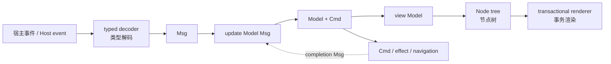
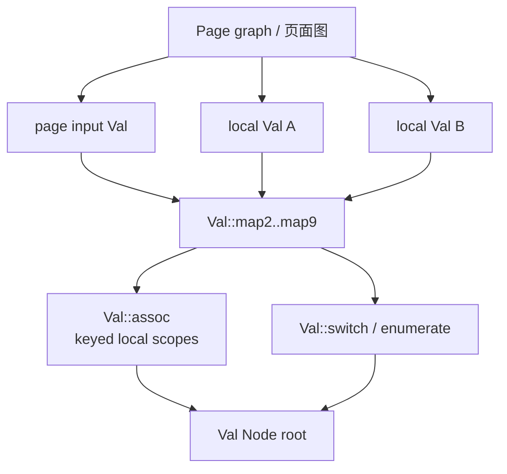
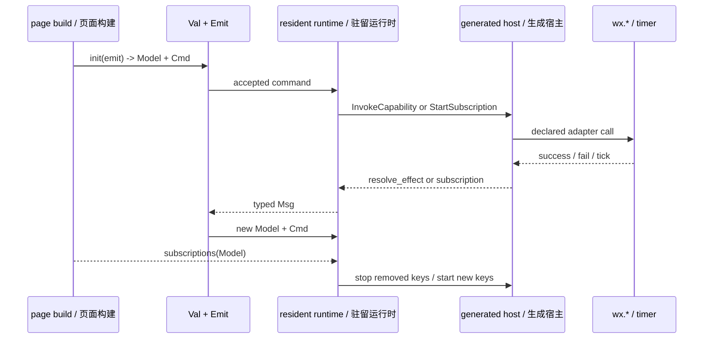

# 02. 应用编写模型 / Authoring Model

[上一篇 / Previous](01-SYSTEM-ARCHITECTURE.md) · [返回索引 / Back](README.md) · [下一篇 / Next](03-INCREMENTAL-GRAPH-AND-TRANSACTIONS.md)

## 1. Model、Msg 与 update / Model, Msg, and update

Minimoon 使用 Elm 风格状态机，但不要求一个全局应用 Model。每个页面或 keyed/dynamic `Val` 分支都可以创建自己的 `(Val[Model], Emit[Msg])`。消息是领域事件，`update` 计算 `(Model, Cmd)`，`view` 只读取当前 Model 并产生不可变 `Node`。

> **English:**
>
> Minimoon uses Elm-style state machines without requiring one global application model. Each page or keyed/dynamic `Val` branch can create its own `(Val[Model], Emit[Msg])`. Messages are domain events, `update` computes `(Model, Cmd)`, and `view` reads the current model to produce an immutable `Node`.



[SVG](assets/diagrams/svg/02-AUTHORING-MODEL-1.svg) · [PNG 3×](assets/diagrams/png/02-AUTHORING-MODEL-1.png) · [Mermaid](assets/diagrams/source/02-AUTHORING-MODEL-1.mmd)

> **源码 / Source:** [`examples/miniapp_conformance_app/src/pages/showcase/page.mbt`](../../examples/miniapp_conformance_app/src/pages/showcase/page.mbt) · symbols: `Model`, `Msg`, `update`

```moonbit
pub struct Model {
  updates : Int
  visits : Int
} derive(Eq)

pub enum Msg {
  Increment
  Reset
  PageShown
  OpenConsole
  OpenLab
  OpenDetails
}

fn update(model : Model, message : Msg) -> (Model, @minimoon.Cmd) {
  match message {
    Increment => @minimoon.no_cmd({ ..model, updates: model.updates + 1 })
    Reset => @minimoon.no_cmd({ ..model, updates: 0 })
    PageShown => @minimoon.no_cmd({ ..model, visits: model.visits + 1 })
    OpenLab =>
      @minimoon.with_cmd(
        model,
        @minimoon.navigate_to(
          @minimoon.route("pages/lab/lab").with_query([
            @minimoon.query("instance", "showcase"),
          ]),
        ),
      )
    // OpenConsole and OpenDetails follow the same command pattern.
    _ => @minimoon.no_cmd(model)
  }
}
```

片段中的最后一个通配分支是文档为缩短摘录而标出的省略，不是源码原样分支；真实函数穷举了六个 `Msg`。关键点是导航不会在 `update` 中直接调用 `wx.navigateTo`，而是作为 opaque `Cmd` 随新 Model 返回，等候候选状态和 UI projection 被接受。

> **English:**
>
> The final wildcard is an explicitly shortened documentation excerpt rather than the literal source; the real function exhaustively handles all six messages. The key point is that navigation does not call `wx.navigateTo` inside `update`. It returns as an opaque `Cmd` with the new model and waits for candidate state and UI projection to be accepted.

## 2. 根 API 如何封装内部状态 / How the Root API Wraps Internal State

`create_state` 返回只读 `Val[Model]` 与可调用的 `Emit[Msg]`。应用可以读、发送和渲染，却拿不到可直接写入的 cell；所有写入都必须经过消息更新和 graph transaction。

> **English:**
>
> `create_state` returns a read-only `Val[Model]` and callable `Emit[Msg]`. Applications can read, send, and render, but cannot obtain a directly writable cell. Every write must pass through message update and a graph transaction.

> **源码 / Source:** [`src/authoring_core.mbt`](../../src/authoring_core.mbt) · symbols: `Emit`, `Val`, `create_state`

```moonbit
pub(all) struct Emit[Msg]((Msg) -> Cmd)

pub fn[Model : Eq, Msg] create_state(
  initial : Model,
  update~ : (Model, Msg, Emit[Msg]) -> (Model, Cmd),
  subscriptions? : (Model, Emit[Msg]) -> Sub,
) -> (Val[Model], Emit[Msg]) {
  let (value, emit) = @val.create_state(
    initial,
    update=(model, message, inner) => {
      let (next, command) = update(model, message, wrap_emit(inner))
      (next, command.0)
    },
  )
  (Val(value), wrap_emit(emit))
}
```

这是一个语义化精简片段：真实实现还完整映射 `subscriptions`，可在源码链接中查看。封装有两个目的：对应用隐藏内部 emitter 表示，并保证 `Cmd` 只能由 runtime 在候选事务成功后解释。

> **English:**
>
> This is a semantically shortened excerpt; the real implementation also maps `subscriptions` in full, as shown by the source link. Encapsulation hides the internal emitter representation and ensures that only the runtime interprets `Cmd` after a candidate transaction succeeds.

## 3. Val 是增量值，不是 Signal / Val Is an Incremental Value, Not a Signal

`Val[A]` 表示页面 graph 内可增量重算的只读值。`map2` 至 `map9` 组合独立依赖，`assoc` 按 key 保留局部所有权，`switch` 替换单分支，`enumerate` 缓存有限 tag，`enumerate_bounded_by` 为无限 tag 加事务化 LRU 上限。

> **English:**
>
> `Val[A]` represents a read-only value that can be incrementally recomputed inside a page graph. `map2` through `map9` combine independent dependencies, `assoc` retains local ownership by key, `switch` replaces one branch, `enumerate` caches a finite tag domain, and `enumerate_bounded_by` adds a transactional LRU bound for unbounded tags.



[SVG](assets/diagrams/svg/02-AUTHORING-MODEL-2.svg) · [PNG 3×](assets/diagrams/png/02-AUTHORING-MODEL-2.png) · [Mermaid](assets/diagrams/source/02-AUTHORING-MODEL-2.mmd)

> **源码 / Source:** [`src/authoring_core.mbt`](../../src/authoring_core.mbt) · symbols: `Val::map2`, `Val::assoc`, `Val::enumerate_bounded_by`

```moonbit
pub fn[A : Eq, B : Eq, C] Val::map2(
  a : Val[A],
  b : Val[B],
  map : (A, B) -> C,
) -> Val[C] {
  Val(@val.Val::map2(a.0, b.0, map))
}

pub fn[K : Hash + Eq, V : Eq, C : Eq] Val::assoc(
  self : Val[Vector[(K, V)]],
  map : (K, Val[V]) -> Val[C],
) -> Val[Vector[C]] {
  Val(self.0.assoc((key, value) => map(key, Val(value)).0))
}
```

`Eq` 约束不是装饰：graph 用它判断写入是否改变值、projection 是否需要继续、缓存输入是否可复用。keyed child 的 key 则同时承担 UI identity 和局部 state/subscription scope identity；不稳定 key 会表现为组件重建，而不是普通重绘。

> **English:**
>
> The `Eq` constraints are not decorative. The graph uses them to determine whether a write changed a value, whether projection should continue, and whether cached input is reusable. A keyed child’s key also identifies its local state/subscription scope; unstable keys cause component reconstruction rather than an ordinary repaint.

## 4. Cmd 与 Sub 的生命周期 / Cmd and Sub Lifecycle

`Cmd` 描述一次性工作：同步消息、批处理、本地异步 effect、声明过的 host capability 或导航。`Sub` 描述随当前 Model/页面生命周期持续存在的来源。两者都 opaque，应用不能绕过 runtime 手动完成 effect 或管理 interval handle。

> **English:**
>
> `Cmd` describes one-shot work: a synchronous message, batch, local asynchronous effect, declared host capability, or navigation. `Sub` describes sources that remain active with the current model/page lifecycle. Both are opaque, so applications cannot bypass the runtime to complete effects or manage interval handles manually.



[SVG](assets/diagrams/svg/02-AUTHORING-MODEL-3.svg) · [PNG 3×](assets/diagrams/png/02-AUTHORING-MODEL-3.png) · [Mermaid](assets/diagrams/source/02-AUTHORING-MODEL-3.mmd)

> **源码 / Source:** [`src/authoring_page.mbt`](../../src/authoring_page.mbt) · symbols: `PageContext::every`, `PageContext::lifecycle`

```moonbit
pub fn PageContext::every(
  _self : PageContext,
  key~ : String,
  interval_ms~ : Int,
  command : Cmd,
) -> Sub {
  Sub(@val.sub_every(key~, interval_ms~, command.0))
}

pub fn PageContext::lifecycle(
  _self : PageContext,
  hook~ : PageLifecycleHook,
  command : Cmd,
) -> Sub {
  Sub(@val.sub_lifecycle(hook.host_name(), command.0))
}
```

订阅 key 必须稳定且在当前集合中唯一。模型变化后 runtime 比较旧、新 key：保留者复用 handle，删除者先 dispose，新增者再启动。分支不可见时 graph scope 会暂停相关订阅；scope 真正提交删除时才最终清理。

> **English:**
>
> Subscription keys must be stable and unique in the current set. After a model change, the runtime compares old and new keys: retained keys reuse handles, removed keys are disposed first, and new keys then start. When a branch becomes invisible, its graph scope pauses related subscriptions; final cleanup occurs only when scope deletion commits.

## 5. Page 是工厂，不是单例 / Page Is a Factory, Not a Singleton

`page` 和 `page_with_input` 保存的是创建 `PageProgram` 的闭包。`create_runtime()` 每次执行闭包并建立新 graph，因此页面定义可以是顶层常量式函数，同时页面实例仍然隔离。

> **English:**
>
> `page` and `page_with_input` store a closure that creates a `PageProgram`. Every `create_runtime()` invocation executes the closure and creates a new graph, allowing page definitions to be top-level factory functions while page instances remain isolated.

> **源码 / Source:** [`src/authoring_page.mbt`](../../src/authoring_page.mbt) · symbols: `make_page`, `page`, `page_with_input`

```moonbit
let make_program = fn() {
  let graph = @val.Graph::new()
  let built = graph.build(fn() {
    let input = graph.create_input(initial_input)
    let root = build({ marker: () }, Val(input.0))
    (root, input.1)
  })
  // Lifecycle decoders and PageProgram are created for this graph instance.
  @renderer.page_program(
    id~,
    route=route_path,
    title~,
    model=0,
    update=(message, epoch) => graph_update(graph, message, epoch),
    view=(events, _) => graph.run(fn() { materialize(built.0.0.read(), events) }),
  )
}
```

这是省略 capabilities、subscriptions 和 commit/rollback hooks 的连续逻辑摘要。维护时最容易犯的错误，是把 page factory 外的可变变量捕获成跨实例共享状态；正确的 state、cache 和 subscription 所有权都应在 `make_program` 调用内创建。

> **English:**
>
> This contiguous logic summary omits capabilities, subscriptions, and commit/rollback hooks. A common maintenance error is capturing mutable state outside the page factory and unintentionally sharing it across instances. Correct state, cache, and subscription ownership must be created inside each `make_program` invocation.

## 6. 何时扩展公开 API / When to Extend the Public API

只有重复 dogfood 需求且无法由现有 `Val`、`Emit`、`Cmd`、`Sub` 或 typed capability 表达时，才应扩展根 API。直接公开 mutable signal、patch、`setData` 或 raw `wx.*` callback 会破坏事务边界、host 验证和跨实例隔离，不属于语法便利性改动。

> **English:**
>
> Extend the root API only when repeated dogfood needs cannot be expressed with existing `Val`, `Emit`, `Cmd`, `Sub`, or typed capabilities. Exposing mutable signals, patches, `setData`, or raw `wx.*` callbacks would break transaction boundaries, host validation, and instance isolation; those are not mere ergonomic changes.
