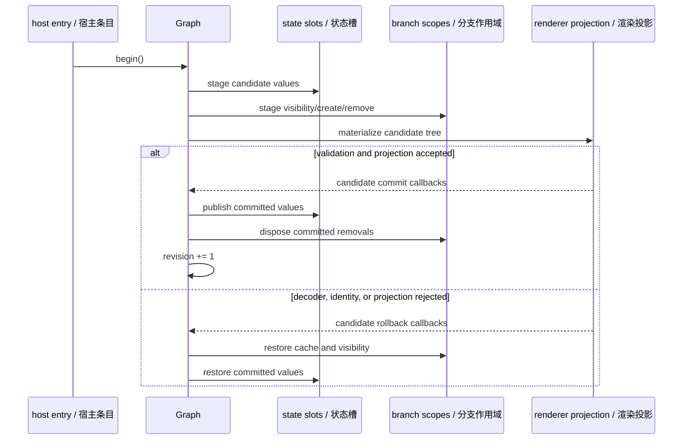
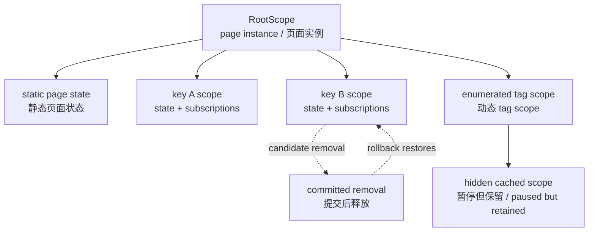

# 03. 增量图与事务 / Incremental Graph and Transactions

[上一篇 / Previous](02-AUTHORING-MODEL.md) · [返回索引 / Back](README.md) · [下一篇 / Next](04-RENDERER-AND-DIFF.md)

## 1. 为什么需要页面级事务 / Why Page-Level Transactions Exist

一次消息可能同时改变多个 state slot、动态分支、事件 handler、订阅、规范化缓存和最终树。如果其中任一环节验证失败，只回滚 Model 会留下“旧 UI 配新 handler”或“已删除 scope 仍在运行订阅”的撕裂状态。Minimoon 因此把所有候选所有权变化 enlist 到同一页面 graph transaction。

> **English:**
>
> One message can change multiple state slots, dynamic branches, event handlers, subscriptions, normalization caches, and the final tree. If any validation step fails, rolling back only the model would leave torn states such as old UI with new handlers or a deleted scope whose subscription still runs. Minimoon therefore enlists every candidate ownership change in one page graph transaction.



[SVG](assets/diagrams/svg/03-INCREMENTAL-GRAPH-AND-TRANSACTIONS-1.svg) · [PNG 3×](assets/diagrams/png/03-INCREMENTAL-GRAPH-AND-TRANSACTIONS-1.png) · [Mermaid](assets/diagrams/source/03-INCREMENTAL-GRAPH-AND-TRANSACTIONS-1.mmd)

## 2. Graph 的提交协议 / Graph Commit Protocol

`Graph::begin` 清空上一候选的回调并开启事务。每个参与对象通过 `enlist` 注册 commit 与 rollback；commit 按登记顺序执行，rollback 逆序执行，类似栈式撤销，确保后创建的 scope 先被恢复或释放。

> **English:**
>
> `Graph::begin` clears callbacks from the previous candidate and opens a transaction. Every participant registers commit and rollback actions through `enlist`. Commit runs in registration order, while rollback runs in reverse order like stack unwinding, ensuring that later-created scopes are restored or released first.

> **源码 / Source:** [`src/val_runtime/val_runtime_00_core.mbt`](../../src/val_runtime/val_runtime_00_core.mbt) · symbols: `Graph::begin`, `Graph::candidate_revision`, `Graph::commit`, `Graph::rollback`

```moonbit
pub fn Graph::begin(self : Graph) -> Unit {
  guard !self.disposed.val else { abort("incremental graph is disposed") }
  guard !self.transaction_active.val else {
    abort("incremental graph transaction is already active")
  }
  self.commits.val = []
  self.rollbacks.val = []
  self.pending_changes.val = 0
  self.transaction_active.val = true
}

pub fn Graph::candidate_revision(self : Graph) -> Int {
  self.revision.val + (if self.pending_changes.val > 0 { 1 } else { 0 })
}

pub fn Graph::rollback(self : Graph) -> Unit {
  if !self.transaction_active.val {
    return
  }
  let callbacks = self.rollbacks.val
  self.commits.val = []
  self.rollbacks.val = []
  self.transaction_active.val = false
  self.pending_changes.val = 0
  for callback in callbacks.rev() {
    callback()
  }
}
```

revision 只在至少一个 state slot 的候选值不同于 committed 值时递增。无变化消息仍可产生 command，但不会伪造新的树 revision；host 因此能把渲染版本与真实可见状态变化对齐。

> **English:**
>
> Revision advances only when at least one state slot has a candidate value different from its committed value. A no-change message may still produce commands, but it does not invent a new tree revision. The host can therefore align render versions with actual visible state changes.

## 3. StateSlot 的两份值 / The Two Values in a StateSlot

每个 slot 保存 `committed` 和可选 `candidate`。候选第一次改变时才登记事务回调；重复更新同一 slot 只改 candidate。rollback 清掉 candidate 并把底层增量 input 写回 committed，从而重新标记依赖图。

> **English:**
>
> Each slot stores a `committed` value and an optional `candidate`. The first candidate change enlists callbacks; repeated writes to the same slot only replace the candidate. Rollback clears the candidate and writes the committed value back into the incremental input, re-establishing dependency-graph state.

> **源码 / Source:** [`src/val_runtime/val_runtime_10_state.mbt`](../../src/val_runtime/val_runtime_10_state.mbt) · symbols: `StateSlot::current`, `StateSlot::stage`

```moonbit
fn[Model] StateSlot::current(self : StateSlot[Model]) -> Model {
  match self.candidate.val {
    Some(value) => value
    None => self.committed.val
  }
}

fn[Model : Eq] StateSlot::stage(self : StateSlot[Model], next : Model) -> Unit {
  if !self.active.val {
    return
  }
  let current = self.current()
  if next == current {
    return
  }
  let was_changed = current != self.committed.val
  if !self.enlisted.val {
    self.enlisted.val = true
    self.graph.enlist(
      fn() {
        match self.candidate.val {
          Some(value) => self.committed.val = value
          None => ()
        }
        self.candidate.val = None
        self.enlisted.val = false
      },
      fn() {
        self.candidate.val = None
        self.enlisted.val = false
        (self.write)(self.committed.val)
      },
    )
  }
  self.candidate.val = Some(next)
  let is_changed = next != self.committed.val
  if was_changed != is_changed {
    self.graph.pending_changes.val += if is_changed { 1 } else { -1 }
  }
  (self.write)(next)
}
```

`active` 把 scope 生命周期带入 state write：已被隐藏或清理的局部 state 即使持有延迟回调，也不能再次改变 graph。它是防止卸载后 effect 回写和已删除 keyed component“复活”的第一道门。

> **English:**
>
> `active` brings scope lifecycle into state writes. Local state in a hidden or cleaned scope cannot mutate the graph again, even if a delayed callback still holds its sender. This is the first guard against post-unload effect writes and deleted keyed components “coming back to life.”

## 4. Scope、可见性与释放 / Scope, Visibility, and Disposal

scope 形成一棵独立于 UI 节点树的所有权树。scope 保存 cleanup 与 visibility callback；父 scope 的隐藏/释放递归传播到子 scope。`RootScope` 属于页面 graph，页面 dispose 时整棵所有权树只能释放一次。

> **English:**
>
> Scopes form an ownership tree separate from the UI node tree. A scope stores cleanup and visibility callbacks, and parent hiding/disposal propagates recursively. `RootScope` belongs to the page graph, and disposing the page releases the entire ownership tree exactly once.



[SVG](assets/diagrams/svg/03-INCREMENTAL-GRAPH-AND-TRANSACTIONS-2.svg) · [PNG 3×](assets/diagrams/png/03-INCREMENTAL-GRAPH-AND-TRANSACTIONS-2.png) · [Mermaid](assets/diagrams/source/03-INCREMENTAL-GRAPH-AND-TRANSACTIONS-2.mmd)

> **源码 / Source:** [`src/internal_duplix/duplix_scope.mbt`](../../src/internal_duplix/duplix_scope.mbt) · symbols: `RootScope::dispose`, `Scope::set_visible`, `Scope::dispose`

```moonbit
fn Scope::set_visible(self : Scope, visible : Bool) -> Unit {
  for callback in self.visibility {
    callback(visible)
  }
  for id in self.sub_scopes {
    if global_scopes.get(id) is Some(scope) {
      scope.set_visible(visible)
    }
  }
}

fn Scope::dispose(self : Self) -> Unit {
  for id in self.sub_scopes {
    if global_scopes.get(id) is Some(scope) {
      scope.dispose()
    }
  }
  for cleanup in self.cleanups {
    cleanup()
  }
  if self.parent is Some(parent) {
    global_scopes[parent].sub_scopes.remove(self.id)
  }
  global_scopes.free(self.id)
}
```

可见性与释放故意分离。`enumerate` 的非活动分支需要保留 state 以便再次切回，但不应继续运行订阅；`assoc` 删除的分支则要等候事务 commit 才最终 dispose，rollback 时重新可见。

> **English:**
>
> Visibility and disposal are intentionally separate. An inactive `enumerate` branch retains state for a later return but should not keep subscriptions running. An `assoc` branch removed by a candidate waits for transaction commit before final disposal and becomes visible again on rollback.

## 5. Keyed assoc 与有界枚举 / Keyed assoc and Bounded Enumeration

`assoc` 为每个 key 创建输入 node、结果 node 和 scope，并用 epoch 标记本轮仍存在的条目。更新相同 key 时只写入输入；缺失 key 的 scope 先隐藏，commit 才 detach/dispose，rollback 则恢复 cache 与 visibility。

> **English:**
>
> `assoc` creates an input node, result node, and scope per key, using an epoch to mark entries still present in the current evaluation. Updating the same key only writes its input. A missing key’s scope first becomes hidden; commit detaches and disposes it, while rollback restores cache membership and visibility.

`enumerate_bounded_by` 在容量满时选择最久未使用分支，但 victim 的 dispose 仍延迟到 commit。rollback 会删除新分支、恢复 victim 和 recency，并重新显示之前的 active scope。因此容量限制不会把一次失败 projection 变成永久状态丢失。

> **English:**
>
> `enumerate_bounded_by` selects the least-recently-used branch when full, but victim disposal still waits for commit. Rollback removes the new branch, restores the victim and recency, and re-shows the previous active scope. Capacity enforcement therefore cannot turn a failed projection into permanent state loss.

> **源码 / Source:** [`src/internal_duplix/duplix_10_dynamic.mbt`](../../src/internal_duplix/duplix_10_dynamic.mbt) · symbol: `Node::enumerate_bounded_by`

```moonbit
let evicted : (String, DynamicBranch[E, A], Int)? = if cache.length() >=
  capacity {
  let victim_tag : Ref[String?] = Ref(None)
  let victim_use = Ref(0)
  for cached_tag, cached_use in recency {
    if victim_tag.val is None || cached_use < victim_use.val {
      victim_tag.val = Some(cached_tag)
      victim_use.val = cached_use
    }
  }
  match victim_tag.val {
    Some(victim_tag) => {
      let victim = cache[victim_tag]
      cache.remove(victim_tag)
      recency.remove(victim_tag)
      Some((victim_tag, victim, victim_use.val))
    }
    None => abort("bounded enumeration cache is inconsistent")
  }
} else {
  None
}
```

这里的 cache 移除只是候选结构变化，不等于资源已释放。紧随其后的 `enlist_transaction` 才定义 commit 时 dispose victim、rollback 时恢复 victim 的行为。审查这类代码时必须一起阅读“立即修改”和“事务补偿”两部分。

> **English:**
>
> Removing the cache entry here is only a candidate structural change; it does not mean resources are already released. The following `enlist_transaction` defines victim disposal on commit and restoration on rollback. Code review must read the immediate mutation and transactional compensation together.

## 6. 失败模式与修改准则 / Failure Modes and Change Rules

事务代码的危险修改包括：在 enlist 前执行不可逆 cleanup、rollback 不按逆序、把 visibility 当作 disposal、复用跨页面 RootScope，以及在 projection 成功前启动 host side effect。任何新增局部资源都必须同时回答“谁拥有、何时暂停、commit 如何释放、rollback 如何恢复、页面卸载如何兜底”。

> **English:**
>
> Dangerous transaction changes include irreversible cleanup before enlistment, non-reversed rollback, treating visibility as disposal, reusing a RootScope across pages, or starting host effects before projection succeeds. Every new local resource must answer: who owns it, when it pauses, how commit releases it, how rollback restores it, and how page unload provides final cleanup.
