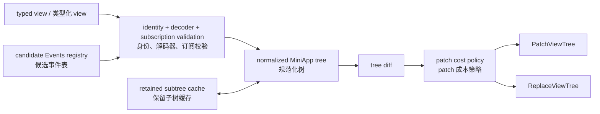
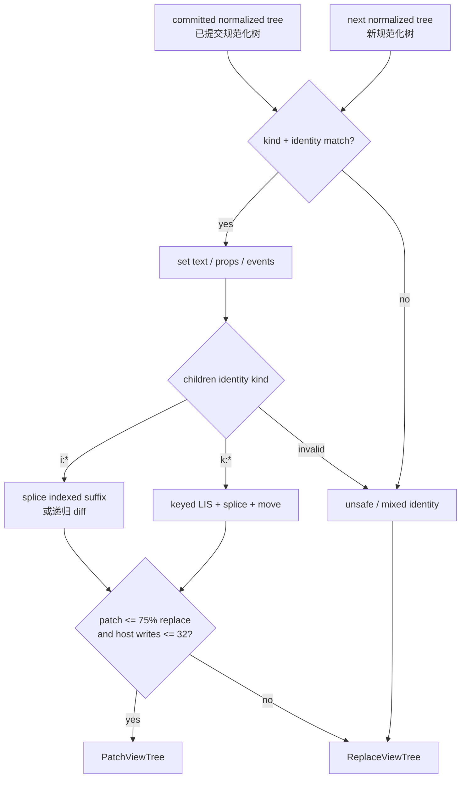
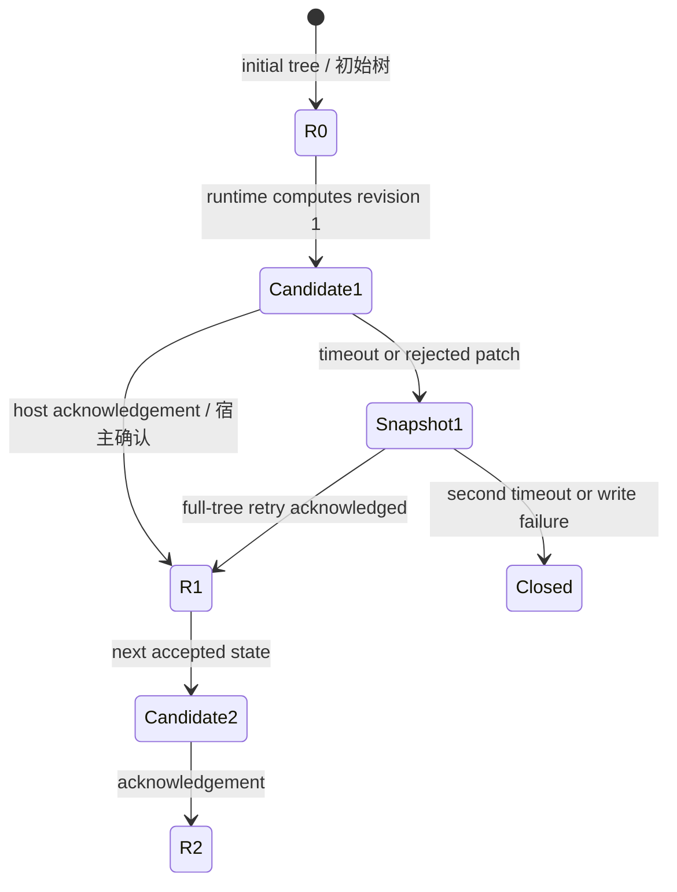

# 04. Renderer 与树差分 / Renderer and Tree Diff

[上一篇 / Previous](03-INCREMENTAL-GRAPH-AND-TRANSACTIONS.md) · [返回索引 / Back](README.md) · [下一篇 / Next](05-RUNTIME-AND-HOST-SCHEDULER.md)

## 1. Renderer 的责任 / Renderer Responsibilities

renderer 不负责业务状态更新，也不直接调用 `setData`。它负责把 typed `Node` 和候选事件 registry 验证成规范化 MiniApp tree，维护 retained subtree cache，比较 committed tree，并输出带 base revision/next revision 的 patch 或 replace command。

> **English:**
>
> The renderer neither updates business state nor calls `setData` directly. It validates typed `Node` values and a candidate event registry into a normalized MiniApp tree, maintains retained-subtree caches, compares the committed tree, and emits a patch or replacement command with base and next revisions.



[SVG](assets/diagrams/svg/04-RENDERER-AND-DIFF-1.svg) · [PNG 3×](assets/diagrams/png/04-RENDERER-AND-DIFF-1.png) · [Mermaid](assets/diagrams/source/04-RENDERER-AND-DIFF-1.mmd)

## 2. 事件先变成候选 registry / Events First Become a Candidate Registry

每次 view 都得到新的 `Events[Msg]`。控件 materialization 注册 event key、kind 和 payload decoder；局部组件通过 scope 前缀合并自己的事件。重复 key、重复 scope、空 key 或 decoder 错误都会拒绝完整候选，而不会局部更新 handler table。

> **English:**
>
> Every view receives a fresh `Events[Msg]`. Control materialization registers event keys, kinds, and payload decoders; local components merge their events under a scope prefix. Duplicate keys, duplicate scopes, empty keys, or decoder failures reject the entire candidate instead of partially updating the handler table.

> **源码 / Source:** [`src/renderer_miniapp/page_program_00_events.mbt`](../../src/renderer_miniapp/page_program_00_events.mbt) · symbols: `PageEvent`, `Events`, `Events::on_candidate_commit`, `Events::on_candidate_rollback`

```moonbit
pub struct PageEvent[Msg] {
  key : String
  kind : PageEventKind
  decode : (Json) -> Result[Msg, MiniappDecodeError]
}

pub struct Events[Msg] {
  owner_id : Int
  entries : Ref[Array[PageEvent[Msg]]]
  entry_keys : Ref[Set[String]]
  entry_index : Ref[Map[String, PageEvent[Msg]]]
  scopes : Ref[Array[String]]
  scope_keys : Ref[Set[String]]
  issues : Ref[Array[String]]
  subscriptions : Ref[Array[HostSubscription[Msg]]]
  scope_cleanups : Ref[Map[String, () -> Unit]]
  candidate_commits : Ref[Array[() -> Unit]]
  candidate_rollbacks : Ref[Array[() -> Unit]]
}
```

事件表与 UI tree 属于同一候选，避免“WXML 绑定了 key，但 runtime 仍保存上一轮 decoder”的竞争。`owner_id` 区分独立 `PageProgram`；root-only registry 会立即 commit，而真实页面候选把回调推迟到 projection 接受。

> **English:**
>
> The event table and UI tree belong to the same candidate, preventing races where WXML binds a key but the runtime still holds the previous decoder. `owner_id` distinguishes independent `PageProgram` instances. A root-only registry may commit immediately, while a real page candidate delays callbacks until projection acceptance.

> **源码 / Source:** [`src/renderer_miniapp/page_program_05_decoders.mbt`](../../src/renderer_miniapp/page_program_05_decoders.mbt) · symbol: `Events::change_bool`

```moonbit
pub fn[Msg] Events::change_bool(
  self : Events[Msg],
  key : String,
  to_msg : (Bool) -> Msg,
) -> PageEvent[Msg] {
  self.custom(key, Change, payload => {
    match event_detail(payload) {
      Ok(detail) =>
        match detail.get("value") {
          Some(True) => Ok(to_msg(true))
          Some(False) => Ok(to_msg(false))
          _ => Err(decode_error("event detail.value must be a boolean"))
        }
      Err(error) => Err(error)
    }
  })
}
```

decoder 在 host JSON 边界检查形状并直接产生 typed `Msg`。应用 update 不读取 `event.detail`，因而无法忽略错误类型或误用 MiniApp 字段；错误会成为 runtime error command，而不是异常状态写入。

> **English:**
>
> The decoder checks shape at the host JSON boundary and directly produces a typed `Msg`. Application update code never reads `event.detail`, so it cannot silently ignore wrong types or misuse MiniApp fields. A failure becomes a runtime error command rather than a state mutation.

## 3. 规范化与 retained cache / Normalization and the Retained Cache

规范化树把多种 typed `Node` 统一成 `{kind, identity, text, props, events, children}`。indexed child identity 使用 `i:n`，keyed child 使用 `k:key`；兄弟 key 必须非空且唯一。宿主 WXML 只解释这一种稳定结构。

> **English:**
>
> Normalization maps typed `Node` variants into `{kind, identity, text, props, events, children}`. Indexed child identities use `i:n`, keyed children use `k:key`, and sibling keys must be non-empty and unique. The host WXML interprets only this stable structure.

> **源码 / Source:** [`src/renderer_miniapp/page_program_30_normalization_core.mbt`](../../src/renderer_miniapp/page_program_30_normalization_core.mbt) · symbol: `normalized_tree_node`

```moonbit
fn normalized_tree_node(
  kind : String,
  identity : String,
  text : String,
  props : MiniappTreeProps,
  children : Array[Json],
) -> Json {
  Json::object({
    "kind": Json::string(kind),
    "identity": Json::string(identity),
    "text": Json::string(text),
    "props": Json::object(props.props),
    "events": Json::object(props.events),
    "children": Json::array(children),
  })
}
```

`Retained(node_id, child)` 允许增量 graph 告诉 renderer：这个 typed subtree 的语义 identity 未改变。cache key 还包含 materialization path，防止同一 retained id 被错误复用到另一个结构位置。候选只写 `updates`，成功后才合并到 active cache。

> **English:**
>
> `Retained(node_id, child)` lets the incremental graph tell the renderer that a typed subtree’s semantic identity has not changed. The cache key also includes the materialization path, preventing the same retained ID from being reused at another structural position. A candidate writes only to `updates`; those entries merge into the active cache after success.

> **源码 / Source:** [`src/renderer_miniapp/page_program_35_normalization_emit.mbt`](../../src/renderer_miniapp/page_program_35_normalization_emit.mbt) · symbols: `retained_cache_key`, `checked_normalize_node`

```moonbit
fn retained_cache_key(identity : Int, path : String) -> String {
  identity.to_string() + "@" + path.length().to_string() + ":" + path
}

match node {
  @ui.Retained(node_id, child) => {
    let key = retained_cache_key(node_id, path)
    cache_children.push(key)
    context.reached.add(key)
    match context.active.get(key) {
      Some(entry) => {
        context.cache_hits.val += 1
        Ok(entry.tree)
      }
      None => {
        let children : Array[String] = []
        match checked_normalize_node(child, identity, path, context, children) {
          Ok(tree) => {
            context.updates[key] = { tree, children }
            Ok(tree)
          }
          Err(error) => Err(error)
        }
      }
    }
  }
  // Non-retained nodes are validated and normalized recursively.
}
```

该摘录省略了“同一候选 updates 已命中”的第一层分支和普通节点分支，但保留了 active-cache 复用与候选写入的核心顺序。cache hit 跳过的是已验证规范化工作，不会跳过 graph 事务或 host revision。

> **English:**
>
> The excerpt omits the first branch for a hit in the same candidate’s `updates` map and the ordinary-node branch, while preserving active-cache reuse and candidate-write ordering. A cache hit skips already validated normalization work; it does not skip the graph transaction or host revision protocol.

## 4. Patch 操作与选择策略 / Patch Operations and Selection Policy



[SVG](assets/diagrams/svg/04-RENDERER-AND-DIFF-2.svg) · [PNG 3×](assets/diagrams/png/04-RENDERER-AND-DIFF-2.png) · [Mermaid](assets/diagrams/source/04-RENDERER-AND-DIFF-2.mmd)

私有 patch protocol 只有 `set`、`splice` 和 `move`。scalar field 直接 set；同长度 indexed children 可递归 diff，否则从公共前缀做一次 splice；keyed children 用 identity map 与最长递增子序列减少 move。任何不安全 shape 都回退完整 replace。

> **English:**
>
> The private patch protocol has only `set`, `splice`, and `move`. Scalar fields use direct sets. Equal-length indexed children can recurse; otherwise one splice replaces the suffix after a common prefix. Keyed children use identity maps and a longest-increasing subsequence to reduce moves. Any unsafe shape falls back to a full replacement.

> **源码 / Source:** [`src/renderer_miniapp/tree_diff_00_model.mbt`](../../src/renderer_miniapp/tree_diff_00_model.mbt) · symbols: `TreePatchOp`, `tree_children_kind`

```moonbit
priv enum TreePatchOp {
  SetTreeField(Array[Json], Json)
  SpliceTreeChildren(Array[Json], Int, Int, Array[Json])
  MoveTreeChild(Array[Json], Int, Int, String, Json)
}

fn tree_children_kind(children : Array[Json]) -> TreeChildrenKind {
  if children.length() == 0 {
    return EmptyChildren
  }
  let keyed = Ref(true)
  let unkeyed = Ref(true)
  let identities : Set[String] = Set([])
  for child in children {
    match tree_child_identity(child) {
      Some(identity) => {
        if !identity.has_prefix("k:") { keyed.val = false }
        if !identity.has_prefix("i:") { unkeyed.val = false }
        if identities.contains(identity) { return InvalidChildren }
        identities.add(identity)
      }
      None => return InvalidChildren
    }
  }
  if keyed.val { KeyedChildren } else if unkeyed.val { UnkeyedChildren } else { InvalidChildren }
}
```

> **源码 / Source:** [`src/renderer_miniapp/tree_diff_10_algorithm.mbt`](../../src/renderer_miniapp/tree_diff_10_algorithm.mbt) · symbol: `should_use_tree_patch`

```moonbit
fn should_use_tree_patch(
  patch_bytes : Int,
  replace_bytes : Int,
  host_write_cost : Int,
) -> Bool {
  patch_bytes * 4 <= replace_bytes * 3 && host_write_cost <= 32
}
```

这条策略拒绝“JSON 稍小但 host 写入很多”的 patch：patch 必须至少节约 25% schema bytes，且估算写入不超过 32。它是确定性 work-shape gate，不是对真机 FPS 的保证。

> **English:**
>
> This policy rejects patches whose JSON is slightly smaller but whose host write count is high. A patch must save at least 25% of schema bytes and require no more than 32 estimated writes. It is a deterministic work-shape gate, not a physical-device FPS guarantee.

## 5. Revision 与 snapshot / Revision and Snapshot



[SVG](assets/diagrams/svg/04-RENDERER-AND-DIFF-3.svg) · [PNG 3×](assets/diagrams/png/04-RENDERER-AND-DIFF-3.png) · [Mermaid](assets/diagrams/source/04-RENDERER-AND-DIFF-3.mmd)

renderer 生成的每个 tree command 都要求 `revision == base_revision + 1`。runtime 在本地维护下一树，host 只在 acknowledgement callback 中发布自己的 revision 和 COW shadow；patch base 不匹配或内容无效时，host 向 runtime 请求 authoritative snapshot，而不是猜测本地状态。

> **English:**
>
> Every tree command emitted by the renderer requires `revision == base_revision + 1`. The runtime maintains the next tree locally, while the host publishes its revision and COW shadow only inside the acknowledgement callback. If a patch base mismatches or content is invalid, the host requests an authoritative runtime snapshot instead of guessing local state.

> **源码 / Source:** [`src/renderer_miniapp/page_program_20_runtime_entry.mbt`](../../src/renderer_miniapp/page_program_20_runtime_entry.mbt) · symbol: `PageProgram::create_runtime` (`take_commands`)

```moonbit
let next_revision = host_revision.val + 1
let replace = @runtime.replace_view_tree(
  self.id,
  payload,
  base_revision=host_revision.val,
  revision=next_revision,
)
let patch = @runtime.patch_view_tree(
  self.id,
  tree_patch_ops_json(ops),
  base_revision=host_revision.val,
  revision=next_revision,
)
if should_use_tree_patch(
    patch.schema_json_size(),
    replace.schema_json_size(),
    tree_patch_host_write_cost(ops),
  ) {
  batch.push(patch)
} else {
  batch.push(replace)
}
```

runtime-side `host_revision` 表示已发出的逻辑树序列；host-side `_rv` 表示微信真正 acknowledgement 的序列。两者通过 one-render-in-flight scheduler 保持最多一个未确认差距，避免在未确认 base 上继续叠加 patch。

> **English:**
>
> Runtime-side `host_revision` represents the logical tree sequence already emitted; host-side `_rv` represents the sequence actually acknowledged by WeChat. The one-render-in-flight scheduler keeps at most one unacknowledged gap and prevents additional patches from being stacked on an uncertain base.

## 6. 修改 renderer 时的检查点 / Renderer Change Checklist

新增控件或属性必须同步更新 typed node、materialization、支持列表、规范化 props、共享 WXML、事件 decoder、host smoke 和真实 Developer Tools 验证。新增 diff operation 还必须更新 protocol validator、COW application、host write cost、统计指标与 fallback 测试；只改 MoonBit enum 不构成完整实现。

> **English:**
>
> A new control or property must update typed nodes, materialization, support lists, normalized props, shared WXML, event decoders, host smoke tests, and real Developer Tools validation. A new diff operation must also update protocol validation, COW application, host-write cost, metrics, and fallback tests. Changing only the MoonBit enum is not a complete implementation.
