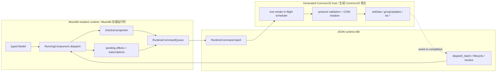
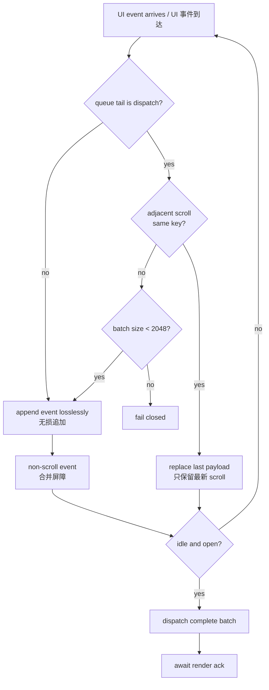
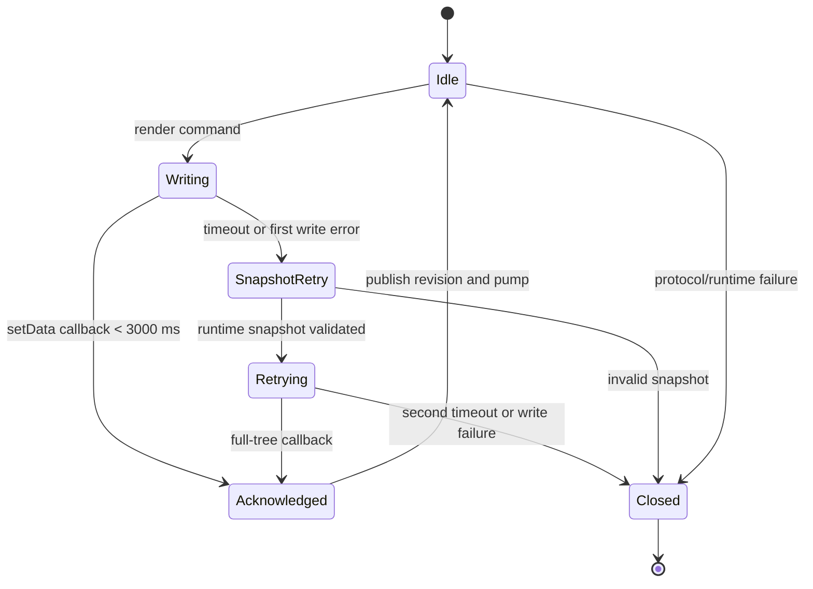
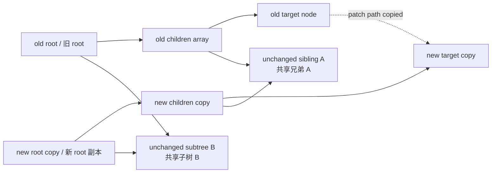

# 05. Runtime 与 Host Scheduler / Runtime and Host Scheduler

[上一篇 / Previous](04-RENDERER-AND-DIFF.md) · [返回索引 / Back](README.md) · [下一篇 / Next](06-BUILD-VERIFY-AND-RELEASE.md)

## 1. 两个运行时层次 / Two Runtime Layers

MoonBit resident runtime 管理 typed Model、update、projection、command、effect 和 subscription；生成的 JavaScript host 管理微信生命周期、宿主事件队列、runtime ABI、tree protocol、`setData` acknowledgement 和 `wx.*` adapter。两层通过 JSON command batch 相连，但职责不同。以下图示和 projection 提交规则描述页面路径；可选 App 使用独立的 `AppDriver` 和宿主队列，不投影页面树，也不等待某个页面的 render acknowledgement。

> **English:**
>
> The MoonBit resident runtime manages typed models, updates, projection, commands, effects, and subscriptions. The generated JavaScript host manages WeChat lifecycle, the host-event queue, runtime ABI, tree protocol, `setData` acknowledgements, and `wx.*` adapters. JSON command batches connect the two layers, but their responsibilities differ. The diagrams and projection commit rules below describe the page path. An optional App uses its own `AppDriver` and host queue: it neither projects a page tree nor waits for an individual page's render acknowledgement.



[SVG](assets/diagrams/svg/05-RUNTIME-AND-HOST-SCHEDULER-1.svg) · [PNG 3×](assets/diagrams/png/05-RUNTIME-AND-HOST-SCHEDULER-1.png) · [Mermaid](assets/diagrams/source/05-RUNTIME-AND-HOST-SCHEDULER-1.mmd)

## 2. Resident runtime 先 projection，再发布 Model / Project Before Publishing Model

`RunningComponent::dispatch` 在一个 command batch 中执行 update。若 projection guard 判定无可见变化，可直接发布 Model 并同步订阅；否则先尝试 checked projection。projection 失败只发 `RuntimeError`，不写 Model、不运行 command，也不切换订阅。

> **English:**
>
> `RunningComponent::dispatch` runs update inside one command batch. If the projection guard detects no visible change, it can publish the model and synchronize subscriptions directly. Otherwise it attempts checked projection first. A projection failure emits only `RuntimeError`: it does not write the model, run the command, or switch subscriptions.

> **源码 / Source:** [`src/runtime_core/runtime_core_15_running_component.mbt`](../../src/runtime_core/runtime_core_15_running_component.mbt) · symbol: `RunningComponent::dispatch`

```moonbit
pub fn[Model, Msg] RunningComponent::dispatch(
  self : RunningComponent[Model, Msg],
  msg : Msg,
) -> ContextWriteResult {
  if self.context.is_disposed() {
    return ContextDisposed
  }
  let result : Ref[ContextWriteResult] = Ref(ContextWriteOk)
  self.context.batch(fn() {
    let (model, cmd) = (self.update)(msg, self.model.val)
    let should_project = match self.projection_guard {
      Some(predicate) => predicate(self.model.val, model)
      None => true
    }
    if !should_project {
      self.model.val = model
      let _ = if self.context.is_mounted() {
        self.sync_subscriptions()
      } else {
        ContextWriteOk
      }
      self.run_cmd(cmd, result)
      return
    }
    match (self.project)(model) {
      Err(error) =>
        ignore(self.context.emit(RuntimeError(self.context.id, "invalid_view", error)))
      Ok(payload) => {
        self.model.val = model
        ignore(self.context.update_state(payload))
        if self.context.is_mounted() { ignore(self.sync_subscriptions()) }
        self.run_cmd(cmd, result)
      }
    }
  })
  result.val
}
```

片段省略了完整的 `ContextDisposed` 结果合并，但保留真实控制顺序。重要不变量是 command 在成功 projection 后运行：例如一次导航 command 不会在 UI 候选被拒绝时仍然离开页面。

> **English:**
>
> The excerpt omits complete aggregation of `ContextDisposed` results but preserves the real control order. The important invariant is that commands run after successful projection. For example, a navigation command cannot leave the page after its UI candidate was rejected.

## 3. Host 队列与 scroll 合并 / Host Queue and Scroll Coalescing

每个页面 host 对 lifecycle、mount、subscription、effect completion 和 UI event 使用一个 FIFO scheduler。第一个 entry 在 idle 时立即执行；当 render 等待 acknowledgement 时 `_bz` 保持 true，后续 entry 留在队列。这样页面 runtime 永远不会基于一个微信尚未确认的树继续执行下一 entry。下图仅展示 scroll 与离散事件的分支；完整的连续事件规则和代码见图后。

> **English:**
>
> Each page host uses one FIFO scheduler for lifecycle, mount, subscriptions, effect completions, and UI events. The first entry starts immediately while idle. While a render waits for acknowledgement, `_bz` remains true and later entries stay queued. The page runtime therefore never executes the next entry on top of a tree that WeChat has not yet acknowledged. The diagram shows only the scroll and discrete-event branches; the complete continuous-event rules and code follow it.



[SVG](assets/diagrams/svg/05-RUNTIME-AND-HOST-SCHEDULER-2.svg) · [PNG 3×](assets/diagrams/png/05-RUNTIME-AND-HOST-SCHEDULER-2.png) · [Mermaid](assets/diagrams/source/05-RUNTIME-AND-HOST-SCHEDULER-2.mmd)

tap、input、change 等离散事件始终无损且有序。在同一 dispatch batch 尾部，相邻、同 key、同类型的 scroll 或 changing 会把旧 payload 替换成最新值；touchmove 还要求 touch identity 相同。离散事件、不同 key/type/touch identity 或其他队列 entry 都阻止跨越合并。这正是快速滑动时数值可能跳跃、但最终位置正确的设计来源。

> **English:**
>
> Discrete events such as tap, input, and change remain lossless and ordered. At the tail of one dispatch batch, adjacent scroll or changing events of the same type and key replace the previous payload with the latest value; touchmove additionally requires the same touch identity. Discrete events, different keys/types/touch identities, and other queue entries prevent coalescing across them. This is why rapid scrolling may show jumps while still converging to the correct latest position.

> **生成产物 / Generated artifact:** [`examples/miniapp_draft_workbench/dist/minimoon.host.js`](../../examples/miniapp_draft_workbench/dist/minimoon.host.js) · owner: [`src/internal_host_js/host_bridge.mbt`](../../src/internal_host_js/host_bridge.mbt), `shared_host_bridge`

```javascript
_ed(type, key, payload) {
  if (this._cl || !this.__mmInstanceId) return
  this._st.receivedUiEvents += 1
  const tail = this._q.length ? this._q[this._q.length - 1] : null
  if (tail && tail.kind === "dispatch") {
    const last = tail.events.length ? tail.events[tail.events.length - 1] : null
    if (type === "scroll" && last && last.type === "scroll" && last.key === key) {
      tail.events[tail.events.length - 1] = { type, key, payload }
      this._st.coalescedEvents += 1
      return
    }
    if (last && last.type === type && last.key === key &&
        (type === "changing" || (type === "touchmove" && touchIdentity(last.payload) === touchIdentity(payload)))) {
      tail.events[tail.events.length - 1] = { type, key, payload }
      this._st.coalescedEvents += 1
      return
    }
    if (tail.events.length >= 2048) {
      this._fc("event batch exceeded the 2048 entry limit")
      return
    }
    tail.events.push({ type, key, payload })
    this._ob(tail)
    return
  }
  const entry = { kind: "dispatch", events: [{ type, key, payload }], warned: false }
  this._q.push(entry)
  this._mq()
  this._ob(entry)
  this._pu()
}
```

生成文件实际是 release-minified 单行 CommonJS；这里展示的是拥有同一逻辑的 MoonBit 模板展开形式，便于审查。256 entries 只触发一次 warning，超过 2048 才 fail closed；`maxEventBatch`、`maxQueueDepth` 和 `coalescedEvents` 让压力可测量。

> **English:**
>
> The committed generated file is release-minified one-line CommonJS. The readable expansion above comes from the MoonBit template that owns the same logic. Reaching 256 entries produces one warning; exceeding 2,048 fails closed. `maxEventBatch`, `maxQueueDepth`, and `coalescedEvents` make pressure measurable.

## 4. acknowledgement 是提交点 / Acknowledgement Is the Commit Point

调用 `setData` 不等于渲染完成。host 为每次写入生成 attempt 和 commit sentinel，保存候选 revision/shadow，并启动 3,000 ms timer。只有 callback 带着仍有效的 generation/attempt 返回时，host 才更新 `_rv` 与 `_sh` 并继续队列。

> **English:**
>
> Calling `setData` does not mean rendering has completed. The host creates an attempt and commit sentinel for each write, stores the candidate revision/shadow, and starts a 3,000 ms timer. Only when the callback returns with the still-current generation and attempt does the host update `_rv` and `_sh` and continue draining the queue.



[SVG](assets/diagrams/svg/05-RUNTIME-AND-HOST-SCHEDULER-3.svg) · [PNG 3×](assets/diagrams/png/05-RUNTIME-AND-HOST-SCHEDULER-3.png) · [Mermaid](assets/diagrams/source/05-RUNTIME-AND-HOST-SCHEDULER-3.mmd)

第一次超时或写入异常会从 runtime 获取 `{revision, tree}` authoritative snapshot，并进行一次完整树写入。snapshot 不合法、retry 写失败或第二次超时都会关闭 scheduler、清空 queue/timer/subscription/effect，避免在不确定 base 上继续执行。

> **English:**
>
> A first timeout or write exception obtains an authoritative `{revision, tree}` snapshot from the runtime and performs one full-tree write. An invalid snapshot, retry write failure, or second timeout closes the scheduler and clears queues, timers, subscriptions, and effects, preventing execution on an uncertain base.

> **生成产物 / Generated artifact:** [`examples/miniapp_draft_workbench/dist/minimoon.host.js`](../../examples/miniapp_draft_workbench/dist/minimoon.host.js) · owner: [`src/internal_host_js/host_bridge.mbt`](../../src/internal_host_js/host_bridge.mbt), methods `_sw`, `_ar`, `_to`, `_rt`

```javascript
_sw(candidate, generation, done, retried, writer) {
  if (generation !== this._gn || this._cl) return
  const attempt = ++this._ra
  const commit = ++this._ct
  this._pr = { candidate, generation, done, retried, attempt, startedAt: Date.now() }
  this._at = setTimeout(() => this._to(generation, attempt), 3000)
  try { writer(commit, () => this._ar(generation, attempt)) }
  catch (error) {
    clearTimeout(this._at)
    this._at = null
    this._pr = null
    if (retried) this._fc("snapshot render write failed", error)
    else this._rt("render write failed", { candidate, generation, done, retried, attempt }, error)
  }
}

_ar(generation, attempt) {
  const pending = this._pr
  if (!pending || pending.generation !== generation || pending.attempt !== attempt || this._cl) return
  clearTimeout(this._at)
  this._rv = pending.candidate.revision
  this._sh = pending.candidate.shadow
  this._st.renderCommits += 1
  pending.done()
}
```

generation token 在 unload 时递增，因此旧页面的迟到 callback 不能提交到新实例。attempt token 则拒绝同一 generation 内已被 timeout/retry 取代的 callback。这两个 token 是异步宿主中防止“幽灵确认”的核心。

> **English:**
>
> The generation token increments on unload, so a late callback from an old page cannot commit into a new instance. The attempt token rejects callbacks replaced by timeout/retry within the same generation. Together they prevent “ghost acknowledgements” in the asynchronous host.

## 5. COW shadow 为什么必要 / Why the COW Shadow Is Necessary

host 必须先验证 patch 能否应用到 authoritative shadow，才能调用微信更新 API。若每次验证都完整 clone tree，小 patch 的成本会与整树大小线性增长。protocol helper 因此只复制 patch path 上的 object/array 容器，并把 `copies` 计入指标。

> **English:**
>
> The host must validate that a patch applies to the authoritative shadow before calling WeChat update APIs. Full cloning for every validation would make small-patch cost linear in total tree size. The protocol helper therefore copies only object/array containers along the patch path and records `copies` as a metric.



[SVG](assets/diagrams/svg/05-RUNTIME-AND-HOST-SCHEDULER-4.svg) · [PNG 3×](assets/diagrams/png/05-RUNTIME-AND-HOST-SCHEDULER-4.png) · [Mermaid](assets/diagrams/source/05-RUNTIME-AND-HOST-SCHEDULER-4.mmd)

> **源码 / Source:** [`src/internal_host_js/protocol_bridge.mbt`](../../src/internal_host_js/protocol_bridge.mbt) · symbol: generated `copyPath`

```javascript
function copyPath(root, path) {
  if (!root || typeof root !== "object") return null
  let source = root
  const copiedRoot = Array.isArray(source) ? source.slice() : { ...source }
  let copied = copiedRoot
  let copies = 1
  for (const token of path) {
    if (source == null || typeof source !== "object" || !(token in source)) return null
    source = source[token]
    if (!source || typeof source !== "object") return null
    const next = Array.isArray(source) ? source.slice() : { ...source }
    copied[token] = next
    copied = next
    copies += 1
  }
  return { root: copiedRoot, value: copied, copies }
}
```

scalar leaf patch 的基准要求正好复制 root、children array 和 target node 三个容器。结构 patch 仍受 32 次 host-write cost 上限约束；如果协议验证失败或 advanced update API 不存在，就回退 authoritative snapshot full write。

> **English:**
>
> The scalar-leaf benchmark requires exactly three copied containers: root, children array, and target node. Structural patches remain bounded by the 32 host-write-cost limit. If protocol validation fails or advanced update APIs are unavailable, the host falls back to an authoritative full-snapshot write.

## 6. 指标与真机“跳变”解释 / Metrics and Physical-Device Jumps

`__minimoonRendererStats()` 暴露 received/coalesced events、event batches、最大 batch/queue、ack samples/total/max/last latency、retry/timeout/failure、patch/replace、host writes、`setData`、commit 和 shadow copies。它们能区分三种现象：输入确实丢失、scroll 被有意合并、或 UI acknowledgement 只是延迟。

> **English:**
>
> `__minimoonRendererStats()` exposes received/coalesced events, event batches, maximum batch/queue, acknowledgement samples/total/max/last latency, retries/timeouts/failures, patches/replacements, host writes, `setData`, commits, and shadow copies. These metrics distinguish actual input loss, intentional scroll coalescing, and merely delayed UI acknowledgement.

连续 tap 必须满足 `receivedUiEvents` 与最终 Model 增量一致，顺序不能改变；连续 same-key scroll 允许 `coalescedEvents` 增加，最终 Model 应收敛到最新位置。真机调试链路可能让 acknowledgement 较模拟器慢，因此多个已接收事件会在一次可见更新中集中体现，看起来像跳变，但不等于业务事件丢失。

> **English:**
>
> Continuous taps require `receivedUiEvents` to match the final model increment, with ordering preserved. Continuous same-key scroll may increase `coalescedEvents`, while the model must converge to the latest position. Physical-device debugging can acknowledge more slowly than the simulator, causing several accepted events to become visible in one update. That looks like a jump but is not necessarily business-event loss.

## 7. 卸载与 fail-closed / Unload and Fail-Closed Cleanup

unload 先关闭 scheduler、递增 generation、清空 queue/timer，再通知 runtime lifecycle 与 dispose，最后取消 intervals 和 effects。重复 callback、重复 effect completion 和 unload 后发送都会被 closed/disposed checks 拒绝。

> **English:**
>
> Unload first closes the scheduler, increments generation, and clears queue/timer state. It then notifies runtime lifecycle and disposal, followed by interval and effect cancellation. Repeated callbacks, repeated effect completions, and sends after unload are rejected by closed/disposed checks.

维护 host scheduler 时，任何能绕过 `_pu`、在 `_bz` 为 true 时直接 dispatch runtime、或在 `_ar` 前发布 `_rv/_sh` 的修改，都会破坏 one-render-in-flight 保证。优化延迟应先用指标确认瓶颈，而不是移除 acknowledgement 屏障。

> **English:**
>
> When maintaining the host scheduler, any change that bypasses `_pu`, dispatches the runtime while `_bz` is true, or publishes `_rv/_sh` before `_ar` breaks the one-render-in-flight guarantee. Latency optimization should begin with metrics rather than removing the acknowledgement barrier.
