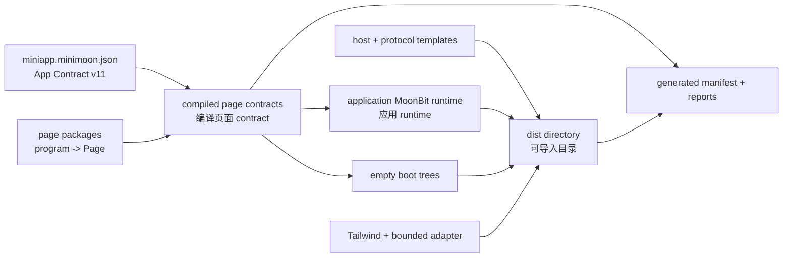
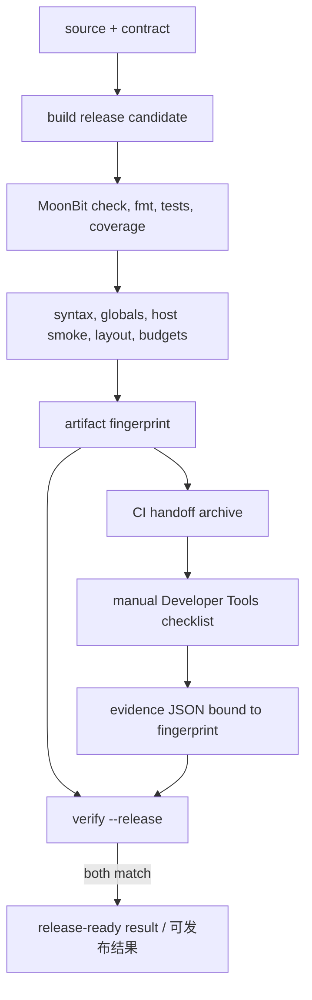

# 06. 构建、验证与发布 / Build, Verify, and Release

[上一篇 / Previous](05-RUNTIME-AND-HOST-SCHEDULER.md) · [返回索引 / Back](README.md) · [下一篇 / Next](07-SYMBOL-INDEX.md)

## 1. App Contract 是构建输入 / App Contract Is the Build Input

应用的 `miniapp.minimoon.json` 使用 App Contract v11，列出应用名、页面 package、输出目录和样式输入。generator 不读取手写 page metadata；它逐页编译页面工厂产生的 contract，再生成 application runtime 和共享 host artifacts。未启用 `application` 时，工厂签名是 `program() -> Page`。

> **English:**
>
> An application’s `miniapp.minimoon.json` uses App Contract v11 to list the application name, page packages, output directory, and style inputs. The generator does not read handwritten page metadata. It compiles contracts produced by page factories, then generates the application runtime and shared host artifacts. Without `application`, factories have the signature `program() -> Page`.

启用 `application` 时，页面工厂改为 `program(deps : @application.Deps) -> Page`，
契约提取在不会启动副作用的 `App.preview` 中执行，另生成 `minimoon.app.js`。
未启用时保留无参数工厂和 `App({})` 注册。

> With `application`, page factories take `@application.Deps`, contract extraction
> runs inside effect-free `App.preview`, and generation emits `minimoon.app.js`.
> Without it, factories stay no-argument and registration remains `App({})`.

带必填输入的页面使用显式 `preview_input` 提取 contract，真实输入则在宿主 Load 创建 runtime 前解码。`smokeInput` 只向自动宿主 smoke 提供测试参数，不成为实际默认值；空 boot tree 由首个 Load 的全量 revision-1 渲染替换。

> Required-input pages use explicit `preview_input` for contract extraction; real input is decoded before runtime creation at host Load. `smokeInput` supplies automated host-smoke data only, never runtime defaults. The first Load replaces the empty boot tree with the complete revision-1 render.



[SVG](assets/diagrams/svg/06-BUILD-VERIFY-AND-RELEASE-1.svg) · [PNG 3×](assets/diagrams/png/06-BUILD-VERIFY-AND-RELEASE-1.png) · [Mermaid](assets/diagrams/source/06-BUILD-VERIFY-AND-RELEASE-1.mmd)

> **源码 / Source:** [`src/tooling_miniapp/generator.mbt`](../../src/tooling_miniapp/generator.mbt) · symbol: `generate`

```moonbit
let pages = array(raw, "pages")
guard pages.length() > 0 else {
  abort(
    "App Contract v" +
    @versions.app_contract_version().to_string() +
    " pages must not be empty",
  )
}
let module_id = module_name(@fs.read_file(join(app_root, "moon.mod")).text())
let application = object(raw, "MiniApp config").get("application")
let release = mode == "release"
let contracts : Array[Json] = []
let routes : Array[String] = []
for index = 0; index < pages.length(); index = index + 1 {
  let page = pages[index]
  let package_path = string(page, "package")
  let contract = compile_page_contract(app_root, module_id, index, page, application?)
  validate_contract(contract, package_path)
  let route = string(contract, "route")
  guard !routes.contains(route) else {
    abort("duplicate page route: " + route)
  }
  routes.push(route)
  contracts.push(contract)
}
let app_runtime = compile_app_runtime(
  app_root, module_id, pages, contracts, release, application?,
)
```

真实源码在编译异常和重复 route 时写入带 JSON pointer 的 MMN diagnostic；片段省略了错误包装但保留生成顺序。页面 contract 同时提供 route、title、initial tree、capabilities、lifecycle 和 inputs，使 generator 可以审计宿主边界而不依赖应用内部 Model/Msg。

> **English:**
>
> The real source writes MMN diagnostics with JSON pointers for compilation errors and duplicate routes; the excerpt omits error wrapping while preserving generation order. A page contract provides route, title, initial tree, capabilities, lifecycle, and inputs, allowing the generator to audit the host boundary without knowing the application’s internal model or messages.

## 2. 生成目录的所有权 / Ownership of Generated Layout

一个应用只有一份 `minimoon.runtime.js`、`minimoon.host.js`、`minimoon.protocol.js`、`minimoon.initial.js`、共享递归 WXML 和全局 WXSS。启用 `application` 时另有一份 `minimoon.app.js`。页面 JavaScript 只注册 page index，页面 WXML 只 import shared template，页面 WXSS 必须为空。

> **English:**
>
> An application has one `minimoon.runtime.js`, `minimoon.host.js`, `minimoon.protocol.js`, `minimoon.initial.js`, shared recursive WXML, and global WXSS. With `application`, it also has `minimoon.app.js`. Page JavaScript only registers a page index, page WXML only imports the shared template, and page WXSS must remain empty.

> **源码 / Source:** [`src/tooling_miniapp/generator.mbt`](../../src/tooling_miniapp/generator.mbt) · symbol: `generate` (artifact writes)

```moonbit
if application is Some(_) {
  write(
    join(dist, "minimoon.app.js"),
    emit_host_bridge(app_root, @host_js.application_host_bridge(), release),
  )
  write(
    join(dist, "app.js"),
    "require(\"./minimoon.app.js\").registerMinimoonApp(require(\"./minimoon.runtime.js\"))\n",
  )
} else {
  write(join(dist, "app.js"), "App({})\n")
}
write(join(dist, "app.wxss"), "")
write(
  join(dist, "minimoon.templates.wxml"),
  @renderer.dynamic_templates_wxml(),
)
write_json(join(dist, "app.json"), app_json(routes))
write_json(join(dist, "project.config.json"), project_config(name, "touristappid"))
write(join(dist, "minimoon.host.js"), host_bridge)
write(join(dist, "minimoon.protocol.js"), protocol_bridge)
write(join(dist, "minimoon.initial.js"), initial_bridge)
write(join(dist, "minimoon.runtime.js"), app_runtime)
for index = 0; index < contracts.length(); index = index + 1 {
  write_page(dist, contracts[index], index)
}
```

generator 会先保存 developer-local `project.private.config.json`，重建 `dist/`，再把私有配置原样放回；该文件被 `.gitignore` 排除。其他生成文件必须完全由 contract 与固定工具链重建，不能保存人工修补。

> **English:**
>
> The generator preserves developer-local `project.private.config.json`, rebuilds `dist/`, and restores the private file; `.gitignore` excludes it. Every other generated file must be reproducible from the contract and pinned toolchain and must not preserve manual patches.

## 3. Build 是编排层 / Build Is an Orchestration Layer

native build package 顺序执行 generator、Tailwind/WeApp adapter 和 release summary。Tailwind adapter 是仓库唯一独立维护的 JavaScript 文件，因为它需要调用 JS-only PostCSS 与 class escaping API；其源码与 MoonBit embedded copy 必须完全一致且受 100 行上限保护。

> **English:**
>
> The native build package runs the generator, Tailwind/WeApp adapter, and release summary in order. The Tailwind adapter is the repository’s only standalone maintained JavaScript because it must call JS-only PostCSS and class-escaping APIs. Its source must exactly match the MoonBit embedded copy and remain under a 100-line ceiling.

> **源码 / Source:** [`src/tooling_minimoon_build/build.mbt`](../../src/tooling_minimoon_build/build.mbt) · symbol: `build`

```moonbit
pub async fn build(
  root : String,
  config_path : String,
  mode : String,
) -> String {
  let config_file = if Path::is_absolute(config_path) {
    Path::normalize(config_path).to_string()
  } else {
    Path::join(root, config_path).normalize().to_string()
  }
  let generated = @miniapp_tooling.generate(config_file, mode)
  generate_tailwind(generated)
  @miniapp_tooling.write_release_summary(generated, mode)
  let dist = string(generated, "distDirAbs")
  println(
    "MiniApp " +
    string(generated, "name", fallback="app") +
    " generated from App Contract v" +
    field(generated, "schemaVersion").stringify() +
    " in " +
    mode +
    " mode at " +
    Path::relative(dist, base=root).to_string(),
  )
  dist
}
```

`dev` 与 `build` 最终共享此路径，因此 watcher 不拥有第二套生成规则。release mode 影响 runtime/host minification；任何模式差异都必须由 generator 明确决定，不能散落在页面源码。

> **English:**
>
> `dev` and `build` eventually share this path, so the watcher does not own a second generation implementation. Release mode controls runtime/host minification. Any mode difference must be explicit in the generator rather than scattered through page source.

## 4. 自动验证与人工证据 / Automated Verification and Manual Evidence



[SVG](assets/diagrams/svg/06-BUILD-VERIFY-AND-RELEASE-2.svg) · [PNG 3×](assets/diagrams/png/06-BUILD-VERIFY-AND-RELEASE-2.png) · [Mermaid](assets/diagrams/source/06-BUILD-VERIFY-AND-RELEASE-2.mmd)

candidate gate 可在 Linux CI 完成：warning-free check、格式、native/js tests、coverage、生成稳定性、语法/host simulation、size/performance 和 archive consumer。release gate 额外要求当前 fingerprint 的真实 Developer Tools passed evidence。

> **English:**
>
> The candidate gate can complete in Linux CI: warning-free checks, formatting, native/JS tests, coverage, generation stability, syntax/host simulation, size/performance, and archive-consumer validation. The release gate additionally requires passed real Developer Tools evidence for the current fingerprint.

evidence JSON 只作为本机 release gate 输入，由 Git 忽略。candidate gate 不读取它，CI 不复制或上传它，因此公开报告不会暴露验证时间、工具版本、备注或结果。

> **English:**
>
> Evidence JSON is a Git-ignored input to the local release gate only. The candidate gate does not read it, and CI neither copies nor uploads it, so public reports do not expose the validation time, tool version, notes, or outcome.

> **源码 / Source:** [`src/tooling_minimoon_verify/verify_00_files.mbt`](../../src/tooling_minimoon_verify/verify_00_files.mbt) · symbols: `fingerprint_entry`, `artifact_fingerprint`

```moonbit
fn fingerprint_entry(hash : UInt64, relative : String, content : Bytes) -> UInt64 {
  let path = @utf8.encode(relative)
  let with_path_length = fingerprint_length(hash, path.length())
  let with_path = fingerprint_bytes(with_path_length, path)
  let with_content_length = fingerprint_length(with_path, content.length())
  fingerprint_bytes(with_content_length, content)
}

let mut hash = 14695981039346656037UL
for relative in files {
  let file = join(app_root, relative)
  hash = fingerprint_entry(hash, relative, @fs.read_file(file).binary())
}
"fnv1a64-relpath-v2:" + hash.to_string(radix=16)
```

fingerprint 同时包含相对路径和内容，避免“相同字节被移动到另一个宿主角色”仍得到同一结果。它用于关联报告和证据，不是安全签名；CI handoff 另外生成 SHA-256 文件表和压缩包哈希。

> **English:**
>
> The fingerprint includes both relative paths and contents, preventing identical bytes moved to another host role from producing the same result. It correlates reports and evidence; it is not a security signature. CI handoff separately produces a SHA-256 file list and archive hash.

## 5. Verifier 检查什么 / What the Verifier Checks

verifier 检查文件完整性、App Contract/ABI/protocol 版本、Skyline 配置、`setting.es6/enhance/minified=true`、CommonJS 语法、禁止的语法与 globals、共享 WXML/WXSS layout、host smoke、capability 声明、artifact budgets、报告一致性和 evidence fingerprint。

> **English:**
>
> The verifier checks file completeness, App Contract/ABI/protocol versions, Skyline configuration, `setting.es6/enhance/minified=true`, CommonJS syntax, forbidden syntax and globals, shared WXML/WXSS layout, host smoke behavior, capability declarations, artifact budgets, report consistency, and evidence fingerprint.

> **源码 / Source:** [`src/tooling_minimoon_verify/verify_10_generated.mbt`](../../src/tooling_minimoon_verify/verify_10_generated.mbt) · symbol: `generated_checks`

```moonbit
let (devtools_compile_ok, devtools_compile_detail) =
  check_devtools_host_project_config(join(dist, "project.config.json"))
checks.push(
  status(
    "devtools-host-boundary",
    devtools_compile_ok,
    if devtools_compile_ok {
      "generated CommonJS uses the verified WeChat ES6-to-ES5, enhanced compilation, and minification boundary"
    } else {
      devtools_compile_detail
    },
  ),
)
```

这些设置不是通用 MiniApp 建议，而是当前产物验证过的宿主边界。修改 CommonJS、语法目标、base library、Skyline 或编译设置，都属于兼容性迁移，需要重新生成、自动验证和真实宿主验证。

> **English:**
>
> These settings are not generic MiniApp advice; they are the host boundary validated for current artifacts. Changing CommonJS, syntax target, base library, Skyline, or compilation settings is a compatibility migration requiring regeneration, automated verification, and real-host validation.

## 6. 当前证据状态的解释 / Interpreting the Current Evidence State

受跟踪的 automated report 固定为 passed candidate，且 `release=false`；release summary 的 DevTools 状态固定为 pending。这是公开仓库策略，不表示或推断任何操作者的本机验证状态。

> **English:**
>
> The tracked automated report is always a passed candidate with `release=false`, and the release summary always keeps Developer Tools pending. This is public-repository policy and neither states nor implies an operator's local validation status.

文档或测试工作不能手工改 evidence 解除 pending。操作者只有在本机导入当前未修改 `dist/`、完成真实 checklist、记录实际工具版本/时间并再次 `verify --release` 后，才能作出本地 release 决策；随后运行 `check:candidate` 恢复公开候选报告。

> **English:**
>
> Documentation or test work must not edit evidence to clear pending status. A local release decision requires importing the current unchanged `dist/`, completing the real checklist, recording the actual tool version/time, and running `verify --release`; `check:candidate` then restores the public candidate reports.
