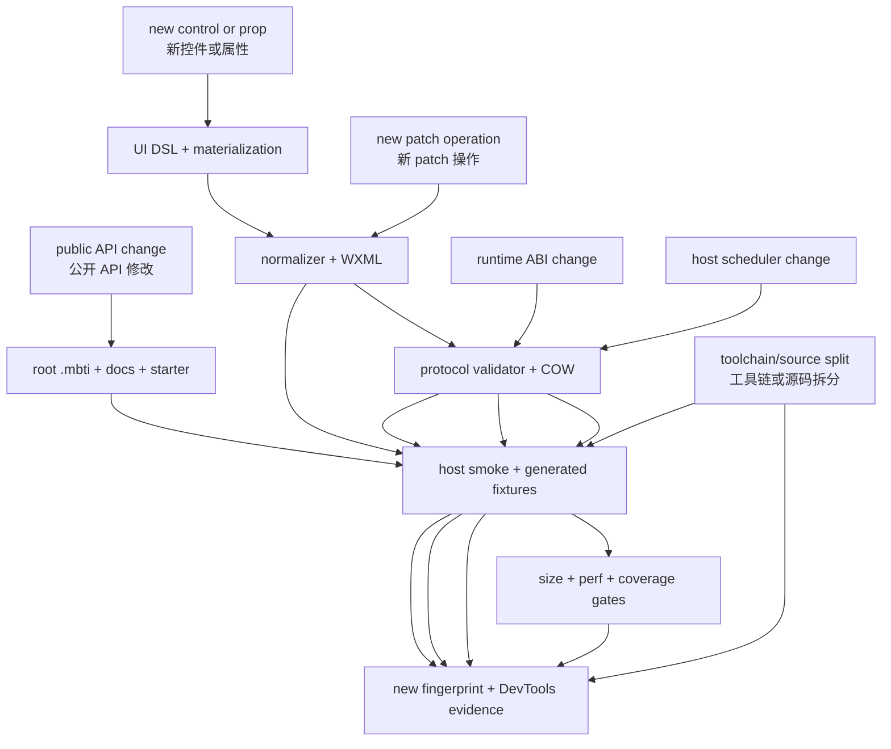

# 07. 符号索引与修改影响 / Symbol Index and Change Impact

[上一篇 / Previous](06-BUILD-VERIFY-AND-RELEASE.md) · [返回索引 / Back](README.md) · [下一篇 / Next](08-RISKS-TESTING-AND-PERFORMANCE.md)

## 1. 使用方法 / How to Use This Index

本索引不是完整 API reference，而是维护导航：从要修改的行为找到所有权 package、关键 symbol、需要同步的下游层和最低验证级别。公开 API 的最终事实仍以 `src/pkg.generated.mbti` 为准。

> **English:**
>
> This is not a complete API reference. It is a maintenance map from desired behavior to owning package, key symbol, downstream layers, and minimum validation level. `src/pkg.generated.mbti` remains authoritative for the public API.

## 2. 应用公开表面 / Application-Facing Surface

| 能力 / Capability | 关键符号 / Key symbols | 所有权 / Owner | 修改时检查 / Change checks |
| --- | --- | --- | --- |
| 状态机 / State machine | `Val`, `Emit`, `create_pure_state`, `create_state`, `create_state_with_init`, `create_state_with_input`, `create_variable`, `create_resource` | root `authoring_core` | root `.mbti`, Val mapping, rollback tests, example compilation |
| 增量组合 / Incremental composition | `Val`, `map`–`map9`, `assoc`, `switch`, `enumerate`, `enumerate_bounded_by` | root wrapper + `val_runtime` | identity, scope visibility/disposal, cache bounds, perf |
| 命令 / Commands | `Cmd`, `none`, `batch`, `delay`, `effect`, `perform`, `attempt` | root wrapper + runtime | accepted-projection ordering, disposal, async tests |
| 订阅 / Subscriptions | `Sub`, `PageContext::every`, lifecycle helpers | root page API + runtime | stable keys, pause/remove/start ordering, unload |
| 页面 / Pages | `Page`, `PageRuntime`, `page`, `page_with_input` | `authoring_page` | decode before graph, explicit preview, Result, first-Load Replace, instance isolation |
| 应用测试 / App testing | `launch`, `TestApp::mount`, `quiesce` | `testing/application` | bounded ready-work drain, shared ownership, independent page disposal |
| UI / Controls | `Node`, layout functions, input/switch/picker/swiper/navigation controls | `authoring_ui*` + `ui_dsl` | normalization, WXML, event decoder, DevTools |
| 宿主能力 / Host capabilities | `Capability`, `HostError`, login/storage/request/location/media/payment/navigation | `authoring_commands` | declaration manifest, adapter validation, host smoke |
| 路由 / Routing | `Route`, `route`, `query`, navigation commands | root navigation API | URL validation, stack fallback, capability list |

公开类型刻意 opaque：应用能组合行为，但不能构造 graph cell、runtime command、tree patch 或 raw host adapter。若新 API 需要暴露内部 package 名称，应先重新设计边界，而不是把内部 type 加进 root `.mbti`。

> **English:**
>
> Public types are intentionally opaque. Applications can compose behavior but cannot construct graph cells, runtime commands, tree patches, or raw host adapters. If a new API would expose an internal package name, redesign the boundary before adding that internal type to the root `.mbti`.

> **源码 / Source:** [`src/pkg.generated.mbti`](../../src/pkg.generated.mbti) · symbols: public package surface

```moonbit
pub fn[Model : Eq, Msg] create_state(
  Model,
  update~ : (Model, Msg, Emit[Msg]) -> (Model, Cmd),
  subscriptions? : (Model, Emit[Msg]) -> Sub,
) -> (Val[Model], Emit[Msg])

pub fn[K : Hash + Eq, V : Eq, C : Eq] Val::assoc(
  Self[Vector[(K, V)]],
  (K, Self[V]) -> Self[C],
) -> Self[Vector[C]]

pub fn page(
  id~ : String,
  route~ : Route,
  title~ : String,
  capabilities? : Array[Capability],
  build~ : (PageContext) -> Val[Node],
) -> Page
```

`.mbti` 只描述调用者可见形状，不描述实现算法。内部重构通过“`.mbti` 无 diff”证明没有改变 package surface，但仍需运行行为和生成字节检查。

> **English:**
>
> `.mbti` describes caller-visible shape rather than implementation algorithms. An internal refactor uses “no `.mbti` diff” to prove package-surface stability, but still requires behavior and generated-byte checks.

## 3. 内部所有权索引 / Internal Ownership Index

下表按“谁维护不变量”而不是按目录字母顺序组织。一个功能可能经过多层，但每个关键语义只能有一个最终所有者。

> **English:**
>
> The table is organized by who owns each invariant rather than by directory order. A feature may cross several layers, but every critical semantic rule must have one final owner.

| 子系统 / Subsystem | 关键符号 / Key symbols | 主要文件组 / Primary files | 核心不变量 / Core invariant |
| --- | --- | --- | --- |
| Graph transaction | `Graph::begin/commit/rollback`, `StateSlot::stage` | `val_runtime` | all candidate writes commit or roll back together |
| Scope ownership | `RootScope`, `with_scope`, `assoc_projected`, `enumerate_bounded_by` | `internal_duplix` | visibility is reversible; disposal occurs once |
| Event registry | `Events`, `PageEvent`, scoped inclusion | renderer event/decoder files | candidate tree and handlers share one commit |
| Normalization | `render_candidate`, `checked_normalize_node`, cache commit/prune | renderer normalization files | only validated normalized trees become active |
| Tree diff | `TreePatchOp`, `diff_miniapp_trees`, `should_use_tree_patch` | renderer tree-diff files | unsafe or expensive changes replace safely |
| Resident runtime | `RunningComponent::dispatch`, `run_cmd`, `ComponentContext` | `runtime_core` | command/effect work follows accepted projection |
| Runtime ABI | `Page::create_runtime`, `PageProgram::create_runtime`, dispatch/flush/snapshot/dispose closures | root page + renderer runtime-entry files | decode before graph; Model/Msg never cross JSON host boundary |
| Host scheduler | generated `_ed`, `_pu`, `_sw`, `_ar`, `_rt`, `_fc` | `internal_host_js/host_bridge` | ordered entries; one unacknowledged render maximum |
| Host protocol | generated `validateNode`, `applyPatch`, `copyPath` | `internal_host_js/protocol_bridge` | validate before write; COW from authoritative shadow |
| Generation | `generate`, `compile_app_runtime`, artifact emitters | `tooling_miniapp` | App Contract deterministically owns `dist/` |
| Build | `build`, `generate_tailwind`, embedded adapter parity | `tooling_minimoon_build` | one orchestration path for dev/release |
| Verification | `artifact_fingerprint`, `generated_checks`, evidence checks | `tooling_minimoon_verify` | automated facts and real-host evidence stay separate |
| Host smoke | `host_smoke_source` with per-page inputs | `internal_host_js/validation_sources` | smokeInput is test data, not a host runtime default |
| CLI | argparse command routing, init/dev/add/build/verify | `cmd/minimoon` | aliases delegate; CLI does not duplicate framework logic |

## 4. 高扩散修改点 / High-Propagation Change Points



[SVG](assets/diagrams/svg/07-SYMBOL-INDEX-1.svg) · [PNG 3×](assets/diagrams/png/07-SYMBOL-INDEX-1.png) · [Mermaid](assets/diagrams/source/07-SYMBOL-INDEX-1.mmd)

新增控件是典型高扩散修改：公开 constructor、UI node/attrs、materialization、normalizer support list、props schema、event decoder、shared WXML、host protocol、generator smoke、fixture interaction 和真实 DevTools 都可能受影响。只有测试 root function 不足以证明完成。

> **English:**
>
> A new control is a typical high-propagation change. Its public constructor, UI node/attrs, materialization, normalizer support list, props schema, event decoder, shared WXML, host protocol, generator smoke tests, fixture interaction, and real Developer Tools validation may all be affected. Testing only the root function does not prove completion.

源码拆分看似低风险，但 MoonBit release minification 使用文件边界分配 symbol，可能改变 `minimoon.runtime.js`。因此“无 API 变化”和“无产物变化”是两个独立结论。

> **English:**
>
> A source split appears low-risk, but MoonBit release minification can assign symbols using file boundaries and change `minimoon.runtime.js`. “No API change” and “no artifact change” are therefore independent conclusions.

## 5. 常用修改入口 / Common Change Entrypoints

从行为出发选择入口，并沿表中的验证列走到生成产物或真实宿主边界；不要只停在第一个能编译的 package。

> **English:**
>
> Start from the behavior, then follow the validation column through generated artifacts or the real-host boundary. Do not stop at the first package that compiles.

| 想实现的行为 / Desired behavior | 首先阅读 / Read first | 然后验证 / Then validate |
| --- | --- | --- |
| 新增本地状态模式 / New local-state pattern | `authoring_core`, `val_runtime_10_state` | transaction rollback, branch ownership, root `.mbti` |
| 新增动态列表策略 / New dynamic-list policy | `duplix_10_dynamic`, keyed guide | scope cleanup, LRU/identity tests, perf |
| 新增 UI 控件 / New UI control | `authoring_ui_20_controls`, renderer normalization | WXML, payload decoder, fixture, DevTools |
| 调整 diff / Change diff | `tree_diff_*`, protocol bridge | native/js diff tests, host smoke, COW benchmark |
| 调整高频事件策略 / Change high-frequency events | host `_ed/_pu`, scheduler smoke | deterministic delayed ack, 100k pressure, device metrics |
| 新增 `wx.*` capability | `authoring_commands`, host `_iv` | declaration audit, success/fail/unavailable, unload cancel |
| 改构建输出 / Change artifact layout | tooling generator + verifier | drift, archive consumer, budgets, DevTools evidence |
| 改 CLI ergonomics / Change CLI ergonomics | `cmd/minimoon`, build/verify APIs | argparse cases, path diagnostics, no duplicated logic |

## 6. 不应成为扩展点的符号 / Symbols That Must Not Become Extension Points

`TreePatchOp`、normalized tree JSON、runtime command JSON、host `_rv/_sh/_q` 字段、`setData` path、graph state slot、scope ID 和生成 page stub 都是内部协议。应用直接依赖它们会绕过版本检查与回滚，并把 minified implementation detail 变成事实 API。

> **English:**
>
> `TreePatchOp`, normalized-tree JSON, runtime-command JSON, host `_rv/_sh/_q` fields, `setData` paths, graph state slots, scope IDs, and generated page stubs are internal protocols. Direct application dependencies would bypass version checks and rollback and turn minified implementation details into accidental APIs.
