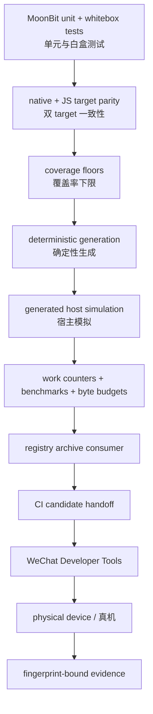
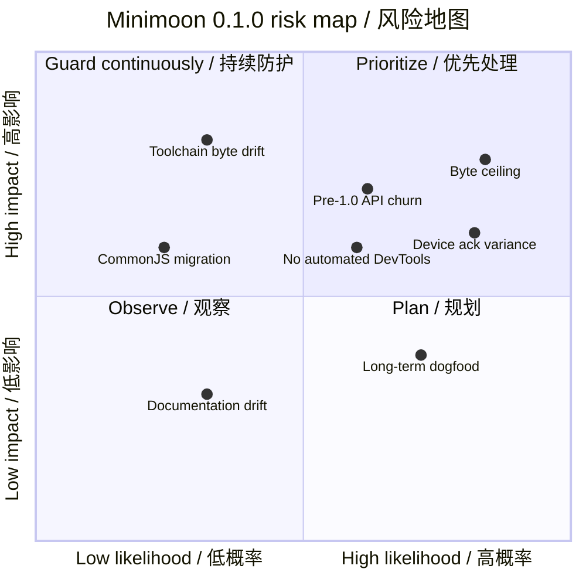

# 08. 风险、测试与性能 / Risks, Testing, and Performance

[上一篇 / Previous](07-SYMBOL-INDEX.md) · [返回索引 / Back](README.md)

## 1. 当前质量结论 / Current Quality Conclusion

Minimoon 0.1.0 已有完整的自动 candidate gate：MoonBit native/js tests、coverage floors、生成稳定性、host simulation、性能 work counters、体积预算、archive consumer 和 CI handoff。它能高置信度发现确定性回归，但不能替代微信真实渲染线程、真机内存和调试链路延迟。

> **English:**
>
> Minimoon 0.1.0 has a complete automated candidate gate: MoonBit native/JS tests, coverage floors, generation stability, host simulation, performance work counters, size budgets, archive consumers, and CI handoff. It detects deterministic regressions with high confidence but cannot replace WeChat’s real rendering thread, physical-device memory, or debugging-path latency.



[SVG](assets/diagrams/svg/08-RISKS-TESTING-AND-PERFORMANCE-1.svg) · [PNG 3×](assets/diagrams/png/08-RISKS-TESTING-AND-PERFORMANCE-1.png) · [Mermaid](assets/diagrams/source/08-RISKS-TESTING-AND-PERFORMANCE-1.mmd)

## 2. 测试分层 / Test Layers

| 层 / Layer | 能证明什么 / What it proves | 不能证明什么 / What it cannot prove |
| --- | --- | --- |
| package unit/whitebox | update、decoder、scope、diff、runtime 状态机 / state-machine semantics | 微信宿主行为 / WeChat host behavior |
| native + JS targets | backend parity 与 JS 编译兼容 / backend parity and JS compilation | release-minified artifact behavior alone |
| generated host smoke | CommonJS、Page registration、scheduler、ack、capability、COW | real glass-easel scheduling and device latency |
| deterministic performance | work counts、cache hit、COW copies、queue bounds、heap retention | user-perceived FPS on a device |
| Developer Tools | exact generated bytes on supported host settings | all device models and future base libraries |
| dogfood | repeated real application pressure / repeated product pressure | exhaustive protocol correctness |

测试声明在基线快照为 148 个，分布在 root API、graph、renderer、runtime、tooling 和 host templates。数量本身不是目标；关键路径还通过 package coverage floors 和特定负向 fixture 防止只覆盖 happy path。

> **English:**
>
> The baseline snapshot contains 148 test declarations across the root API, graph, renderer, runtime, tooling, and host templates. Count is not the goal. Critical paths also use package coverage floors and targeted negative fixtures to prevent happy-path-only coverage.

## 3. Coverage floor 的含义 / Meaning of Coverage Floors

selected production sources 与 root public package 要求至少 80%；renderer 至少 70%；runtime 与 Val runtime 至少 75%。这些是回归门槛，不是“达到后无需再写测试”的目标值。

> **English:**
>
> Selected production sources and the root public package require at least 80% coverage; the renderer requires 70%; runtime and Val runtime require 75%. These are regression floors, not targets after which no more tests are needed.

> **源码 / Source:** [`src/cmd/minimoon_check/coverage.mbt`](../../src/cmd/minimoon_check/coverage.mbt) · symbol: `coverage_suite`

```moonbit
require_coverage(
  "selected production sources",
  production_covered.val,
  production_total.val,
  80,
)
require_coverage_group(entries, "root public package", 80, path => {
  is_coverage_production_source(path) &&
  path.has_prefix("src/") &&
  !path["src/".length():].contains("/")
})
require_coverage_group(entries, "renderer_miniapp package", 70, path => {
  is_coverage_production_source(path) && path.has_prefix("src/renderer_miniapp/")
})
require_coverage_group(entries, "runtime_core package", 75, path => {
  is_coverage_production_source(path) && path.has_prefix("src/runtime_core/")
})
```

最值得新增的测试通常位于跨层边界：候选 projection 失败后的 graph rollback、ack 延迟期间 tap/scroll 队列、unload 后迟到 callback、无 advanced update API 的 snapshot fallback，以及生成文件变更后的 evidence invalidation。

> **English:**
>
> The highest-value new tests usually target cross-layer boundaries: graph rollback after candidate projection failure, tap/scroll queues during delayed acknowledgement, late callbacks after unload, snapshot fallback without advanced update APIs, and evidence invalidation after generated-file changes.

## 4. 高频事件与 acknowledgement 测试 / High-Frequency Event and Acknowledgement Tests

host harness 已覆盖 0、16、150、500 和 2,999 ms acknowledgement，精确 3 秒 timeout，一次 snapshot retry 后 fail closed，2,048 tap 上限，以及 100,000 scroll pressure。tap 必须无损有序；scroll 必须只合并相邻同 key 项，并报告合并数量。

> **English:**
>
> The host harness covers acknowledgement at 0, 16, 150, 500, and 2,999 ms; the exact three-second timeout; fail-closed behavior after one snapshot retry; the 2,048-tap bound; and 100,000-scroll pressure. Taps must remain lossless and ordered. Scrolls may merge only adjacent same-key entries and must report the number merged.

> **源码 / Source:** [`src/internal_host_js/protocol_bridge.mbt`](../../src/internal_host_js/protocol_bridge.mbt) · symbol: generated `createRendererStats`

```javascript
function createRendererStats() {
  return {
    patchCommands: 0, replaceCommands: 0, patchOps: 0,
    hostWriteOps: 0, setDataCalls: 0, renderCommits: 0,
    receivedUiEvents: 0, coalescedEvents: 0, eventBatches: 0,
    maxEventBatch: 0, maxQueueDepth: 0, schedulerWarnings: 0,
    schedulerFailures: 0, renderRetries: 0, renderTimeouts: 0,
    renderAckSamples: 0, renderAckTotalMs: 0,
    renderAckMaxMs: 0, renderAckLastMs: 0, shadowCopies: 0,
  }
}
```

真实设备上遇到跳变时，应保存这些 counter 与操作序列，而不是只看视觉感受。若 tap 接收数、批次顺序和最终 Model 正确，而 ack latency/queue depth 增大，问题更可能是宿主显示延迟；若 received 数就少，则应查事件绑定或微信调试链路。

> **English:**
>
> When a physical device appears to jump, capture these counters and the operation sequence instead of relying only on visual perception. If tap counts, batch order, and final model are correct while acknowledgement latency and queue depth grow, the issue is more likely delayed host visibility. If received count is already low, investigate event binding or the WeChat debugging path.

## 5. 体积预算与当前余量 / Byte Budgets and Current Headroom

基线 Conformance JavaScript 为 284,350 bytes，aggregate ceiling 为 289,750 bytes，只剩 5,400 bytes，约 1.86%。runtime 为 235,543 bytes，低于 270,000 ceiling；host 为 12,779/14,000，initial trees 为 29,590/36,000。aggregate 是当前更紧的约束。

> **English:**
>
> Baseline Conformance JavaScript is 284,350 bytes against a 289,750-byte aggregate ceiling, leaving 5,400 bytes, about 1.86%. Runtime is 235,543/270,000 bytes, host is 12,779/14,000, and initial trees are 29,590/36,000. The aggregate is currently the tighter constraint.

> **源码 / Source:** [`src/cmd/minimoon_check/performance.mbt`](../../src/cmd/minimoon_check/performance.mbt) · symbol: `perf_suite` artifact budgets

```moonbit
guard runtime_size <= 270000 else {
  abort(runtime_path + " exceeds application runtime budget")
}
guard host_size <= 14000 else {
  abort(host_path + " exceeds shared host budget")
}
guard protocol_size <= 10000 else {
  abort(protocol_path + " exceeds shared protocol budget")
}
guard initial_size <= 36000 else {
  abort(initial_path + " exceeds shared initial-tree budget")
}

let aggregate_limit = 289750
let remaining = aggregate_limit - aggregate.val
guard aggregate.val <= aggregate_limit else {
  abort(app + " exceeds aggregate JavaScript performance budget")
}
```

新增公共 API 即使源码很小，也可能让整个泛型实现进入 application runtime。评审应同时查看 release bundle delta、符号来源和 starter/conformance 双重 ceiling；直接提高 ceiling 会掩盖链接边界退化。

> **English:**
>
> A small public API addition can cause an entire generic implementation to enter the application runtime. Review must inspect release-bundle delta, symbol ownership, and both starter and Conformance ceilings. Raising the ceiling directly would hide linkage-boundary degradation.

## 6. 性能 gate 的边界 / Boundaries of Performance Gates

MoonBit benchmarks 覆盖 100、500、2,000 nodes 的 scope ownership、scalar/keyed diff、event lookup、no-op dispatch、mount、retained normalization 与 LIS work。generated host benchmark 要求 scalar patch 精确复制三个容器，并在 100 nodes 至少快 1.10×、在 500/2,000 nodes 至少快 1.50×。

> **English:**
>
> MoonBit benchmarks cover scope ownership, scalar/keyed diff, event lookup, no-op dispatch, mount, retained normalization, and LIS work at 100, 500, and 2,000 nodes. The generated-host benchmark requires a scalar patch to copy exactly three containers and beat full clone by at least 1.10× at 100 nodes and 1.50× at 500/2,000 nodes.

1,000 次 mount/dispatch/dispose stress 在强制 GC 下要求 runtime state、timer 和 interval 保留数归零，heap delta 小于 16 MiB。它能发现确定性泄漏，但 JS engine 与微信容器不同，因此不能宣称真机长期内存已经自动证明。

> **English:**
>
> A 1,000-cycle mount/dispatch/dispose stress run under forced GC requires retained runtime states, timers, and intervals to reach zero and heap delta to stay below 16 MiB. It catches deterministic leaks, but its JavaScript engine differs from the WeChat container, so it cannot prove long-term physical-device memory automatically.

## 7. 风险地图 / Risk Map



[SVG](assets/diagrams/svg/08-RISKS-TESTING-AND-PERFORMANCE-2.svg) · [PNG 3×](assets/diagrams/png/08-RISKS-TESTING-AND-PERFORMANCE-2.png) · [Mermaid](assets/diagrams/source/08-RISKS-TESTING-AND-PERFORMANCE-2.mmd)

最高优先级是守住字节余量并继续收集真机 acknowledgement 数据。其次是 pre-1.0 API 变更成本和 MoonBit 工具链导致的生成字节漂移。CommonJS 当前是已验证边界，迁移 ESM 不是无风险清理任务。

> **English:**
>
> The highest priority is preserving byte headroom while collecting more physical-device acknowledgement data. Next are pre-1.0 API change costs and generated-byte drift caused by the MoonBit toolchain. CommonJS is the currently validated boundary; migrating to ESM is not a risk-free cleanup task.

## 8. 仍需人工或长期闭环的项目 / Items Requiring Human or Long-Term Closure

- 当前 hardening candidate 需要与其精确 fingerprint 对应的新 Developer Tools evidence。
- 真机 ack latency、内存与调试链路不能由 Bun/CI 完整模拟。
- dogfood 应用需要更长周期的真实使用和独立 stress workflow。
- 外部分发、registry publication、兼容周期与升级策略仍需显式 release 决策。
- Developer Tools 自动化仍是未来能力，不能伪装成现有 CI。

> **English:**
>
> - The current hardening candidate needs new Developer Tools evidence for its exact fingerprint.
> - Bun/CI cannot fully simulate physical-device acknowledgement latency, memory, or debugging transport.
> - The dogfood application needs longer real usage and its independent stress workflow.
> - External distribution, registry publication, compatibility cadence, and upgrade policy still require explicit release decisions.
> - Developer Tools automation remains future work and must not be presented as existing CI.
