# Minimoon 双语代码分析 / Minimoon Bilingual Code Analysis

[项目文档 / Project docs](../README.md) · [下一篇：系统架构 / Next: System Architecture](01-SYSTEM-ARCHITECTURE.md) · [高清图表 / High-resolution diagrams](assets/diagrams/README.md)

本专题面向准备维护 Minimoon、审查运行时行为或设计下一阶段功能的工程师。它回答三个问题：应用代码如何变成 Skyline 页面，状态与局部组件为何能事务化更新，以及生成的 CommonJS 宿主如何在真实 `setData` acknowledgement 之前保持顺序和一致性。

> **English:**
>
> This suite is for engineers preparing to maintain Minimoon, review runtime behavior, or design the next feature phase. It answers three questions: how application code becomes a Skyline page, why state and local components update transactionally, and how the generated CommonJS host preserves ordering and consistency until a real `setData` acknowledgement arrives.

## 1. 分析边界 / Analysis Boundary

本文档分析当前源码、测试和生成产物。所有源码标记都指向当前文件，不依赖或公开历史提交。

> **English:**
>
> The analysis covers the current source, tests, and generated artifacts. Every source marker resolves against the current tree and neither depends on nor publishes historical commits.

所有结论都来自当前 Minimoon 源码、测试和生成产物。参考仓库的 MIT 许可双语文档仅提供组织方式和图表交付形式；本专题没有复制其业务内容或实现代码。

> **English:**
>
> Every conclusion comes from the current Minimoon source, tests, and generated artifacts. The MIT-licensed bilingual documentation in the reference repository supplied only an organizational and diagram-delivery pattern; this suite copies neither its domain content nor implementation code.

本专题及高清图是维护者资料，保留在 Git 源仓库中，并通过 `moon.mod` 排除在 250 KiB Moon registry archive 之外；这不会影响应用依赖或生成的小程序字节。

> **English:**
>
> This suite and its high-resolution assets are maintainer material kept in the Git source repository. `moon.mod` excludes them from the 250 KiB Moon registry archive, so they do not affect application dependencies or generated MiniApp bytes.

## 2. 快照规模 / Snapshot Scale

下表是基线提交的可复算规模，不把新文档和文档工具计入产品快照。这里的“非测试 MoonBit”包含 `src/`、Conformance 应用和 starter 源码，但排除 `_test.mbt`、`_wbtest.mbt` 与 `_bench.mbt`。

> **English:**
>
> The table contains reproducible measurements from the baseline commit and excludes the new documentation and its tooling. “Non-test MoonBit” includes `src/`, the Conformance app, and starter sources while excluding `_test.mbt`, `_wbtest.mbt`, and `_bench.mbt`.

| 指标 / Metric | 快照值 / Snapshot value | 复算方式 / Reproduction |
| --- | ---: | --- |
| 已跟踪文件 / Tracked files | 216 | `git ls-files` |
| MoonBit 文件 / MoonBit files | 95 | `git ls-files '*.mbt'` |
| MoonBit 总行数 / Total MoonBit lines | 22,800 | `wc -l` over tracked `.mbt` |
| 非测试 MoonBit 行数 / Non-test MoonBit lines | 18,395 | exclude test/whitebox/bench suffixes |
| MoonBit 包 / MoonBit packages | 23 | tracked `moon.pkg` files |
| 测试声明 / Test declarations | 148 | lines beginning with `test` |
| 生成 MiniApp JavaScript / Generated MiniApp JavaScript | 284,350 bytes | committed Conformance `dist/**/*.js` |
| Git 提交 / Git commits | 20 | `git rev-list --count HEAD` |

这些数字描述的是一个已经超过“单文件实验”的小型框架：核心复杂度集中在事务图、renderer、驻留 runtime、宿主协议以及生成/验证链路，而不是示例页面数量。

> **English:**
>
> These numbers describe a small framework that has moved beyond a single-file experiment. Its complexity is concentrated in the transactional graph, renderer, resident runtime, host protocol, and generation/verification path rather than in the number of example pages.

## 3. 一页代码图 / One-Page Code Graph

```mermaid
flowchart LR
    App[应用 Model / Msg / update<br/>Application state machine]
    Public[根包公开 API<br/>Root public API]
    Val[Val runtime<br/>增量组合 / incremental composition]
    Graph[Duplix graph<br/>事务与作用域 / transactions and scopes]
    Renderer[MiniApp renderer<br/>规范化与 diff / normalization and diff]
    Runtime[Resident runtime<br/>命令与订阅 / commands and subscriptions]
    Generator[App Contract v5 generator<br/>构建与验证 / build and verify]
    Host[CommonJS host scheduler<br/>队列、ack、COW / queue, ack, COW]
    Skyline[WeChat Skyline<br/>WXML / setData / wx.*]

    App --> Public
    Public --> Val
    Val --> Graph
    Graph --> Renderer
    Renderer --> Runtime
    Runtime --> Generator
    Generator --> Host
    Host --> Skyline
    Skyline -. event payload .-> Host
    Host -. decoded Msg .-> Runtime
```

[SVG](assets/diagrams/svg/README-1.svg) · [PNG 3×](assets/diagrams/png/README-1.png) · [Mermaid](assets/diagrams/source/README-1.mmd)

图中箭头不是九个独立进程。前六层主要是编译进应用 runtime 的 MoonBit 代码；generator 和 verifier 是 native 工具；host、protocol、WXML/WXSS 与页面 stub 是生成产物；Skyline 才是外部运行环境。理解“编译期所有权”和“运行期边界”的区别，是阅读本仓库最重要的起点。

> **English:**
>
> The arrows do not represent nine independent processes. The first six layers are primarily MoonBit compiled into the application runtime; the generator and verifier are native tools; the host, protocol, WXML/WXSS, and page stubs are generated artifacts; Skyline is the external runtime. Distinguishing compile-time ownership from runtime boundaries is the most important starting point for reading this repository.

## 4. 建议阅读路线 / Recommended Reading Paths

第一次接触项目时，依次阅读系统架构、authoring model、事务图、renderer 和 host scheduler；这条路线先建立不变量，再进入实现细节。准备修改 API 时，再查符号索引和生成发布章节。

> **English:**
>
> For a first pass, read system architecture, the authoring model, the transactional graph, the renderer, and the host scheduler in that order. This establishes invariants before implementation details. When changing APIs, follow with the symbol index and the generation/release chapter.

- [01 系统架构 / System Architecture](01-SYSTEM-ARCHITECTURE.md)
- [02 Authoring Model](02-AUTHORING-MODEL.md)
- [03 增量图与事务 / Incremental Graph and Transactions](03-INCREMENTAL-GRAPH-AND-TRANSACTIONS.md)
- [04 Renderer 与 Diff / Renderer and Diff](04-RENDERER-AND-DIFF.md)
- [05 Runtime 与 Host Scheduler](05-RUNTIME-AND-HOST-SCHEDULER.md)
- [06 构建、验证与发布 / Build, Verify, and Release](06-BUILD-VERIFY-AND-RELEASE.md)
- [07 符号索引 / Symbol Index](07-SYMBOL-INDEX.md)
- [08 风险、测试与性能 / Risks, Testing, and Performance](08-RISKS-TESTING-AND-PERFORMANCE.md)

> **English:**
>
> - Read chapters 01–05 for the execution model.
> - Use chapter 06 for artifact and release ownership.
> - Use chapter 07 as a change-impact lookup.
> - Use chapter 08 before accepting architectural or performance claims.

## 5. 证据标记 / Evidence Markers

每个源码片段前都有 `源码 / Source` 标记，包含相对路径、关键符号和完整快照 SHA。默认使用连续摘录；为突出控制流而压缩分支或省略瞬时标识时，会显式标为缩短摘录。路径用于浏览当前工作树，快照用于判断文档是否需要重新审查。

> **English:**
>
> Every source excerpt has a `源码 / Source` marker containing a repository-relative path, key symbol, and full snapshot SHA. Excerpts are contiguous by default; branch compression or omitted transient identifiers are explicitly labeled as shortened excerpts. The path supports browsing the current worktree, while the snapshot determines whether the analysis needs review.

生成 JavaScript 片段使用 `生成产物 / Generated artifact` 标记，并同时指明拥有该逻辑的 MoonBit 模板。应用作者不应把生成片段当成扩展接口，也不应直接修改 `dist/` 来修复框架行为。

> **English:**
>
> Generated JavaScript excerpts use a `生成产物 / Generated artifact` marker and identify the MoonBit template that owns the logic. Application authors must not treat generated snippets as extension interfaces or patch framework behavior directly in `dist/`.

## 6. 与现有文档的关系 / Relationship to Existing Documentation

本专题解释“代码为何这样工作”，而现有 [Architecture](../architecture.md)、[MVP](../mvp.md)、[renderer reference](../reference/miniapp_renderer.md) 和 [Developer Tools validation](../operations/miniapp_devtools_validation.md) 仍然是行为约束与操作流程的规范来源。发生冲突时，应以源码、生成报告和现有规范文档为准，并更新本专题。

> **English:**
>
> This suite explains why the code works as it does. The existing [Architecture](../architecture.md), [MVP](../mvp.md), [renderer reference](../reference/miniapp_renderer.md), and [Developer Tools validation](../operations/miniapp_devtools_validation.md) remain normative for behavior and operations. If a conflict appears, source code, generated reports, and normative documents win, and this suite must be updated.
